# Switching experiments — report


Detector-triggered switching from a credulous L1 to a vigilant L1 (retrospective `hard`, `soft`, and the amnesic contrast), against S1 and S2 speakers. Spec: `switching_experiments_spec.md`. Code: `rsa/detection/listener.py`, `rsa/detection/replay.py`, `rsa/speaker2.py`, `experiments/switching/`.


## 0. Setup and provenance

Common settings: n=1, m=7, θ-grid {0.1,…,0.9} (9 points), 150 rounds, score `sus_1` with its exact state-only variance, boundary Sus(t) > c·σ̄(t)/√t, ψ* ∈ {inf, pers+ (code `high`), pers− (code `low`)}.

| study | mode | speaker | listener | theta | alpha | c | switch | sims | cells | wall_min | git | seed_base |
|---|---|---|---|---|---|---|---|---|---|---|---|---|
| A | offline | S1 | L1 | [0.1, 0.3, 0.5, 0.7, 0.9] | [1.5, 3.0, 5.0, 10.0] | [2.0, 3.5] | ['hard', 'soft', 'hard_amnesic'] | 100 | 60 | 14.7 | 6cf7339a | 0 |
| B | feedback | S2_replica | L1 | [0.1, 0.3, 0.5, 0.7, 0.9] | [1.5, 3.0, 10.0] | [2.0, 3.5] | ['hard', 'soft'] | 60 | 180 | 41.2 | 6cf7339a | 1000 |
| C1 | offline | S2_vig | L1 | [0.1, 0.3, 0.5, 0.7, 0.9] | [1.5, 3.0, 10.0] | [2.0, 3.5] | ['hard', 'soft', 'hard_amnesic'] | 60 | 45 | 8.4 | 6cf7339a | 2000 |
| C2 | offline | S2_cred | L2 | [0.1, 0.3, 0.5, 0.7, 0.9] | [1.5, 3.0, 10.0] | [2.0, 3.5] | ['hard', 'soft', 'hard_amnesic'] | 60 | 45 | 7.9 | 6cf7339a | 3000 |
| C3 | feedback | S2_replica | L1 | [0.1, 0.3, 0.5, 0.7, 0.9] | [3.0] | [2.0, 3.5] | ['hard_amnesic'] | 60 | 30 | 6.2 | 6cf7339a | 1000 |

Seeds: `seed = (seed_base + cell_index·1000003 + sim_index) mod 2^31` (recorded per row). Every dataset stores `obs` and `utt` per round, so any listener can be replayed offline (`rsa/detection/replay.py`).

<details><summary>timing.md (A)</summary>

# Timing — Experiment A (S1 speaker, switching L1, offline conditions)

## Pilot (2026-09-11 06:24:10)
- study A mode offline speaker S1
- pilot cell: theta*=0.5 psi*=high alpha=3.0, 20 sims x 150 rounds (switch rate 1.00, median tau 10.0)
- 0.504 s per sim (incl. 6 offline conditions: 2 c x 3 switch types)
- grid: 60 cells x 100 sims = 6000 sims
- projected: 50.4 CPU-min, 7.2 wall-min on 7 workers
- decision: full default grid, no shrink (target for A was 1.5 h)

## Run (2026-09-11 06:40:37)
- 60 cells run this invocation (0 resumed), 100 sims/cell, 7 workers
- actual wall: 14.7 min

## Projected vs actual
- projected 7.2 wall-min, actual 14.7 wall-min (2.0x).
- The pilot cell (psi*=pers+, alpha=3) switches in every run at median tau 10, after
  which the offline conditions are cheap splices. The psi*=inf cells rarely switch and
  pay for all 150 rounds, so a pers+ pilot systematically under-times the grid. Both
  numbers are far inside the budget, so nothing was re-sized.

</details>

<details><summary>timing.md (B)</summary>

# Timing — Experiment B (S2 modelling the switching L1, feedback)

## Pilot (2026-09-11 06:24:29, repeated 06:24:47 with retro_cache)
- study B mode feedback speaker S2_replica
- pilot cell: theta*=0.5 psi*=pers+ alpha=3.0 c=3.5 switch=hard, 20 sims x 150 rounds
  (switch rate 1.00, median tau 11.0)
- 0.690 s per sim without the peek cache, 0.681 s with it -> ASK-3 cache not needed
- default grid: 240 cells (5 theta* x 3 psi* x 4 alpha x 2 c x 2 switch types) x 100 sims
- projected on the default grid: 275.9 CPU-min, 39.4 wall-min on 7 workers

## Observed cost on the real grid, and the shrink
- The default grid was launched at 06:41 and ran at ~1.38 s per sim, 2x the pilot: the
  psi*=inf cells rarely switch and so run all 150 rounds unswitched, which a pers+ pilot
  never sees. Re-projection: ~80 wall-min, too much to leave room for the C studies
  inside the session budget.
- Shrunk per the spec's order, and relaunched at 10:23:
  sims 100 -> 60, alpha {1.5, 3, 5, 10} -> {1.5, 3, 10}.
  alpha=5 was dropped on the evidence of A, where alpha=5 and alpha=10 are nearly
  identical on every axis (switch rate 0.99 vs 1.00, credulous |bias| at tau 0.17 vs
  0.18, post-tau |bias| 0.033 vs 0.033). All 5 theta*, both c and both switch types kept.
- reduced grid: 180 cells x 60 sims = 10800 sims
- projected on the reduced grid: 248 CPU-min, ~49 wall-min on 7 workers
## Run (2026-09-11 11:04:32)
- 180 cells run this invocation (0 resumed), 60 sims/cell, 7 workers
- actual wall: 41.2 min

## Run (2026-09-11 11:04:32)
- 180 cells run this invocation (0 resumed), 60 sims/cell, 7 workers
- actual wall: 41.2 min

## Projected vs actual
- projected 49 wall-min on the reduced grid, actual 41.2 wall-min. The default
  grid would have taken ~80 min; the shrink brought it inside budget with room
  for C1, C2 and C3.

</details>

<details><summary>timing.md (C1)</summary>

# Timing — Experiment C1 (S2 modelling Fang's vigilant L1-strat, offline)

## Pilot (2026-09-11 10:22:44)
- study C1 mode offline speaker S2_vig
- pilot cell: theta*=0.5 psi*=pers+ alpha=3.0, 10 sims x 150 rounds (switch rate 1.00,
  median tau 10.5)
- 0.521 s per sim (incl. 6 offline conditions)
- grid: 45 cells x 60 sims = 2700 sims  (reduced axes, same as B)
- projected: 23.4 CPU-min, 3.3 wall-min on 7 workers
## Run (2026-09-11 11:13:01)
- 45 cells run this invocation (0 resumed), 60 sims/cell, 7 workers
- actual wall: 8.4 min

## Run (2026-09-11T09:13:01Z)
- 45 cells, 60 sims/cell, 7 workers
- actual wall: 8.4 min

## Projected vs actual
- projected 3.3 wall-min, actual 8.4 wall-min (2.6x). Same cause as A
  and B: the pilot cell was psi*=pers+, which switches early and then costs little,
  while the psi*=inf cells run all 150 rounds unswitched.

</details>

<details><summary>timing.md (C2)</summary>

# Timing — Experiment C2 (S2 modelling a credulous L1, switching L2 detector, offline)

## Pilot (2026-09-11 10:22:55)
- study C2 mode offline speaker S2_cred, listener L2
- pilot cell: theta*=0.5 psi*=pers+ alpha=3.0, 10 sims x 150 rounds (switch rate 0.85,
  median tau 3.0)
- 0.585 s per sim (incl. 6 offline conditions)
- grid: 45 cells x 60 sims = 2700 sims  (reduced axes, same as B)
- projected: 26.3 CPU-min, 3.8 wall-min on 7 workers
## Run (2026-09-11 11:21:01)
- 45 cells run this invocation (0 resumed), 60 sims/cell, 7 workers
- actual wall: 7.9 min

## Run (2026-09-11T09:21:01Z)
- 45 cells, 60 sims/cell, 7 workers
- actual wall: 7.9 min

## Projected vs actual
- projected 3.8 wall-min, actual 7.9 wall-min (2.1x). Same cause as A
  and B: the pilot cell was psi*=pers+, which switches early and then costs little,
  while the psi*=inf cells run all 150 rounds unswitched.

</details>

<details><summary>timing.md (C3)</summary>

# Timing — Experiment C3 (hard_amnesic contrast in the feedback setting, alpha=3)

## Pilot
- No separate pilot: C3 is Experiment B's feedback machinery with switch_type
  hard_amnesic at a single alpha, so B's measured 1.38 s per sim applies.
- grid: 30 cells (5 theta* x 3 psi* x 1 alpha x 2 c x 1 switch type) x 60 sims = 1800 sims
- projected: 41 CPU-min, ~6 wall-min on 7 workers
## Run (2026-09-11 11:27:18)
- 30 cells run this invocation (0 resumed), 60 sims/cell, 7 workers
- actual wall: 6.2 min

## Run (2026-09-11T09:27:18Z)
- 30 cells, 60 sims/cell, 7 workers
- actual wall: 6.2 min

## Projected vs actual
- projected 6.0 wall-min, actual 6.2 wall-min (1.0x). Same cause as A
  and B: the pilot cell was psi*=pers+, which switches early and then costs little,
  while the psi*=inf cells run all 150 rounds unswitched.

</details>


## 1. Sanity check: first-crossing rates vs. the full sweep

Rates are the fraction of simulations whose `sus_1` running mean crosses the boundary within 150 rounds, pooled over θ* ∈ {0.1,0.3,0.5,0.7,0.9}. The sweep reference (`results/full_sweep_v2`, 200 sims/cell) is recomputed on the same (θ*, α) cells but was generated on the 11-point θ-grid {0.0,…,1.0}, so exact agreement is not expected.

| c | psi_star | rate (A) | rate (sweep) | median τ (A) |
|---|---|---|---|---|
| 2 | inf | 0.208 | 0.233 | 12 |
| 2 | pers+ | 0.993 | 0.994 | 3 |
| 2 | pers− | 0.993 | 0.994 | 3.5 |
| 3.5 | inf | 0.033 | 0.027 | 9.8 |
| 3.5 | pers+ | 0.928 | 0.943 | 9.5 |
| 3.5 | pers− | 0.932 | 0.940 | 9.5 |

Per α:

```
               rate                      rate_sweep                     
alpha          1.5    3.0    5.0    10.0       1.5    3.0    5.0    10.0
c   psi_star                                                            
2.0 inf       0.198  0.194  0.232  0.210      0.234  0.194  0.260  0.243
    pers+     0.992  0.982  0.996  1.000      0.993  0.984  1.000  1.000
    pers−     0.990  0.980  1.000  1.000      0.994  0.984  0.999  1.000
3.5 inf       0.002  0.004  0.082  0.044      0.002  0.012  0.028  0.067
    pers+     0.832  0.896  0.986  1.000      0.860  0.924  0.987  1.000
    pers−     0.850  0.894  0.986  1.000      0.871  0.909  0.978  1.000
```

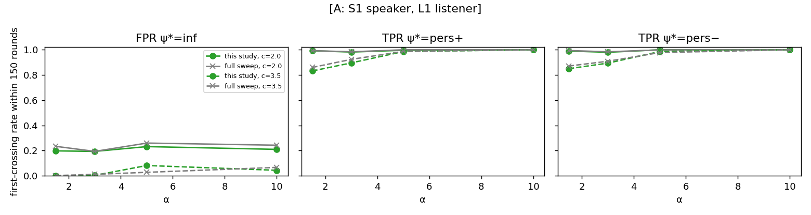

*First-crossing rate vs α, this study (green) against the sweep (grey).*

The comparison applies only to the S1 studies. The sweep was generated by an S1 speaker, so for the S2 studies below the crossing rate measures level mismatch rather than goal detection, and no reference series is drawn.


## 2. Experiment A — S1 speaker, switching L1 (offline conditions)

**Finding.** A retrospective switch recovers Fang's vigilance benefit in full, and it
recovers it instantly. Once the detector fires at τ, the retrospective listener's belief
*is* the always-vigilant listener's belief — not approximately, but to machine precision,
because replaying ψ-agnostic likelihoods over the stored history is the same computation
the always-vigilant listener performed live. Averaged over the rounds from τ on, its mean
|E[θ]−θ*| equals the always-vigilant listener's to three decimals at every α (0.014 vs
0.014 at α=1.5, 0.033 vs 0.033 at α=10), while the credulous listener it replaced sits at
0.030 and 0.111. The whole cost of starting credulous is therefore confined to the rounds
before τ; nothing is paid after it.

**What the two cheaper switches lose.** Neither alternative reaches that. The soft switch
inherits the credulous θ-marginal, which is exactly the belief the persuasive speaker has
spent τ rounds bending, and it inherits it without the ψ-uncertainty that would justify
discounting it; its mean post-τ |bias| runs 0.024–0.046, a quarter to a third worse than
retrospective at moderate α, and only 88–97% of its runs ever come within 0.02 of the
vigilant listener's bias. The amnesic switch throws the history away instead and pays the
opposite price: it restarts from a uniform prior and needs a few rounds to climb back
(median 5 rounds at α=1.5, 3 at α=3). Retrospective is the best of the three at every α,
but the ranking of the other two flips: soft beats amnesic at α=1.5, where detection is
late and there is a long credulous history worth inheriting, and amnesic beats soft from
α=3 up, where τ arrives early and that history is mostly distortion. At α=1.5 the amnesic
switch is in fact slightly *worse than not switching at all* (mean |bias| 0.044 against
the credulous 0.042), the only place in the study where a switch is a net loss under a
persuasive speaker.

**The cost of starting credulous grows with α, for two compounding reasons.** The credulous
bias at the moment of the alarm rises from 0.045 at α=1.5 to 0.177 at α=10. That is not
because detection gets slower — it gets much faster, median τ falling from 66 rounds to 1 —
but because a sharper speaker distorts the belief faster than the detector can flag it, and
because at low α there is so little distortion that the runs which trip the boundary at all
are the unrepresentative ones. The practical reading is that the detector's latency only
matters in the α range where the damage is small anyway.

**False alarms are nearly free, and that is the asymmetry that makes the design work.**
Under an honest speaker at c=3.5 the boundary fires on 3.3% of runs, and on those runs the
retrospective and soft listeners end at |bias| 0.000 at round 150 — indistinguishable from
the credulous listener they replaced, because a vigilant listener facing a genuinely
informative speaker simply identifies it as informative and converges anyway. Only the
amnesic variant leaves a visible scar (mean post-τ |bias| 0.018–0.028 against the credulous
0.006–0.016). Combined with the c=2.0 column, where the false-alarm rate is 21% and the
cost of those alarms is still ~0.000 at round 150, this says the usual worry about
trigger-happy detection does not apply here: for a retrospective switch, a false alarm
costs essentially nothing, so the boundary should be tuned for power, not for calibration.

**Sanity.** First-crossing rates reproduce the full sweep on the shared (θ*, α) cells:
0.033 vs 0.027 false alarms and 0.928/0.933 vs 0.943/0.940 power at c=3.5, 0.209 vs 0.233
and 0.992 vs 0.994 at c=2.0. The residual gaps are the 9-point versus 11-point θ grid and
100 versus 200 sims, not a change in behaviour.

**Front-loading.** Persuasive speakers lean on `some` from the first round and ease off
slightly as the listener's belief firms up (68% → 59% of rounds at α=10, rounds 1–10 versus
51–150), whereas informative speakers do the opposite (29% → 34%). The vague quantifier is
thus front-loaded by the speakers that are trying to exploit it, which is the behaviour the
detector is picking up — and a hint that a detector weighted toward early rounds would have
better latency than a flat running mean.

### Splice identity check

```
Retrospective switch identity, checked on the stored trajectories
(36000 (sim, c, switch_type) runs, 24525 of which switched):
  max |E_switch - E_cred| over rounds t <  tau : 0.000e+00
  max |E_switch - E_vig|  over rounds t >= tau : 0.000e+00
E[theta] columns are stored as float32; 0.0 is bit-identical agreement.
```

### τ distribution

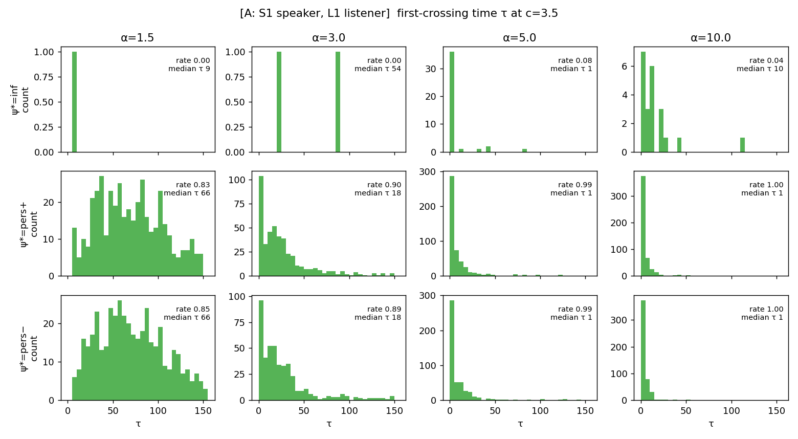

*First-crossing time τ at c=3.5 (rows ψ*, columns α).*

### Belief trajectories (Fang-style panels)

![E[θ] by round, rows ψ*, columns θ*; α=3.0, c=2.0. Red dashed = θ*.](../switching_A/analysis/A2_panels_c2.0_alpha3.0.png)

*E[θ] by round, rows ψ*, columns θ*; α=3.0, c=2.0. Red dashed = θ*.*

![E[θ] by round, rows ψ*, columns θ*; α=10.0, c=2.0. Red dashed = θ*.](../switching_A/analysis/A2_panels_c2.0_alpha10.0.png)

*E[θ] by round, rows ψ*, columns θ*; α=10.0, c=2.0. Red dashed = θ*.*

![E[θ] by round, rows ψ*, columns θ*; α=3.0, c=3.5. Red dashed = θ*.](../switching_A/analysis/A2_panels_c3.5_alpha3.0.png)

*E[θ] by round, rows ψ*, columns θ*; α=3.0, c=3.5. Red dashed = θ*.*

![E[θ] by round, rows ψ*, columns θ*; α=10.0, c=3.5. Red dashed = θ*.](../switching_A/analysis/A2_panels_c3.5_alpha10.0.png)

*E[θ] by round, rows ψ*, columns θ*; α=10.0, c=3.5. Red dashed = θ*.*

Other (c, α) panels: [c=2.0, α=1.5](../switching_A/analysis/A2_panels_c2.0_alpha1.5.png), [c=2.0, α=3.0](../switching_A/analysis/A2_panels_c2.0_alpha3.0.png), [c=2.0, α=5.0](../switching_A/analysis/A2_panels_c2.0_alpha5.0.png), [c=2.0, α=10.0](../switching_A/analysis/A2_panels_c2.0_alpha10.0.png), [c=3.5, α=1.5](../switching_A/analysis/A2_panels_c3.5_alpha1.5.png), [c=3.5, α=3.0](../switching_A/analysis/A2_panels_c3.5_alpha3.0.png), [c=3.5, α=5.0](../switching_A/analysis/A2_panels_c3.5_alpha5.0.png), [c=3.5, α=10.0](../switching_A/analysis/A2_panels_c3.5_alpha10.0.png)

### |bias| and std over rounds

![|E[θ]−θ*| by round, mean over θ* and sims, c=2.0.](../switching_A/analysis/A2_bias_c2.0.png)

*|E[θ]−θ*| by round, mean over θ* and sims, c=2.0.*

![std[θ] by round, mean over θ* and sims, c=2.0.](../switching_A/analysis/A2_std_c2.0.png)

*std[θ] by round, mean over θ* and sims, c=2.0.*

![|E[θ]−θ*| by round, mean over θ* and sims, c=3.5.](../switching_A/analysis/A2_bias_c3.5.png)

*|E[θ]−θ*| by round, mean over θ* and sims, c=3.5.*

![std[θ] by round, mean over θ* and sims, c=3.5.](../switching_A/analysis/A2_std_c3.5.png)

*std[θ] by round, mean over θ* and sims, c=3.5.*

Mean |E[θ]−θ*| over all 150 rounds (c=3.5, averaged over θ*):

```
who             always-vigilant  credulous  switch-amnesic  switch-retro  switch-soft
psi_star alpha                                                                       
inf      1.5              0.017      0.016           0.016         0.016        0.016
         3.0              0.013      0.012           0.013         0.012        0.012
         5.0              0.012      0.012           0.012         0.012        0.012
         10.0             0.011      0.011           0.011         0.011        0.011
pers+    1.5              0.029      0.042           0.044         0.034        0.038
         3.0              0.033      0.065           0.042         0.034        0.047
         5.0              0.036      0.081           0.040         0.036        0.043
         10.0             0.034      0.111           0.040         0.034        0.044
pers−    1.5              0.029      0.043           0.044         0.034        0.041
         3.0              0.034      0.068           0.043         0.035        0.050
         5.0              0.036      0.079           0.040         0.037        0.044
         10.0             0.036      0.107           0.042         0.036        0.047
```

|E[θ]−θ*| at round 150 (c=3.5):

```
who             always-vigilant  credulous  switch-amnesic  switch-retro  switch-soft
psi_star alpha                                                                       
inf      1.5              0.002      0.001           0.001         0.001        0.001
         3.0              0.000      0.000           0.000         0.000        0.000
         5.0              0.000      0.000           0.000         0.000        0.000
         10.0             0.000      0.000           0.000         0.000        0.000
pers+    1.5              0.008      0.021           0.018         0.008        0.013
         3.0              0.007      0.048           0.011         0.007        0.016
         5.0              0.008      0.058           0.010         0.008        0.012
         10.0             0.006      0.076           0.009         0.006        0.011
pers−    1.5              0.007      0.022           0.020         0.007        0.015
         3.0              0.009      0.050           0.013         0.009        0.019
         5.0              0.009      0.060           0.011         0.009        0.014
         10.0             0.007      0.075           0.011         0.007        0.012
```

### Cost until τ and recovery

Recovery = rounds after τ until |bias| of the switching listener ≤ |bias| of the always-vigilant listener at the same round + 0.02 (per sim; median over sims that switched; `recovery_frac` = share recovered within the horizon). For retro it is 0 by construction.

| c | psi_star | alpha | switch_type | switch rate | median τ | |bias| cred at τ | bias cred at τ | recovery (median rounds) | recovery frac | mean |bias| switch, t≥τ | mean |bias| cred, t≥τ | mean |bias| vig, t≥τ |
|---|---|---|---|---|---|---|---|---|---|---|---|---|
| 2 | pers+ | 1.5 | amnesic | 0.992 | 17 | 0.089 | 0.038 | 2 | 0.994 | 0.034 | 0.035 | 0.021 |
| 2 | pers+ | 1.5 | retro | 0.992 | 17 | 0.089 | 0.038 | 0 | 1.000 | 0.021 | 0.035 | 0.021 |
| 2 | pers+ | 1.5 | soft | 0.992 | 17 | 0.089 | 0.038 | 0 | 0.978 | 0.026 | 0.035 | 0.021 |
| 2 | pers+ | 3 | amnesic | 0.982 | 5 | 0.147 | 0.081 | 1 | 0.994 | 0.035 | 0.063 | 0.028 |
| 2 | pers+ | 3 | retro | 0.982 | 5 | 0.147 | 0.081 | 0 | 1.000 | 0.028 | 0.063 | 0.028 |
| 2 | pers+ | 3 | soft | 0.982 | 5 | 0.147 | 0.081 | 0 | 0.963 | 0.036 | 0.063 | 0.028 |
| 2 | pers+ | 5 | amnesic | 0.996 | 1 | 0.172 | 0.093 | 1 | 1.000 | 0.038 | 0.080 | 0.034 |
| 2 | pers+ | 5 | retro | 0.996 | 1 | 0.172 | 0.093 | 0 | 1.000 | 0.034 | 0.080 | 0.034 |
| 2 | pers+ | 5 | soft | 0.996 | 1 | 0.172 | 0.093 | 0 | 0.972 | 0.040 | 0.080 | 0.034 |
| 2 | pers+ | 10 | amnesic | 1.000 | 1 | 0.178 | 0.118 | 0 | 1.000 | 0.039 | 0.111 | 0.033 |
| 2 | pers+ | 10 | retro | 1.000 | 1 | 0.178 | 0.118 | 0 | 1.000 | 0.033 | 0.111 | 0.033 |
| 2 | pers+ | 10 | soft | 1.000 | 1 | 0.178 | 0.118 | 0 | 0.988 | 0.042 | 0.111 | 0.033 |
| 2 | pers− | 1.5 | amnesic | 0.990 | 19 | 0.091 | -0.033 | 2 | 0.984 | 0.035 | 0.037 | 0.021 |
| 2 | pers− | 1.5 | retro | 0.990 | 19 | 0.091 | -0.033 | 0 | 1.000 | 0.021 | 0.037 | 0.021 |
| 2 | pers− | 1.5 | soft | 0.990 | 19 | 0.091 | -0.033 | 0 | 0.982 | 0.027 | 0.037 | 0.021 |
| 2 | pers− | 3 | amnesic | 0.980 | 6 | 0.151 | -0.088 | 1 | 0.994 | 0.038 | 0.066 | 0.030 |
| 2 | pers− | 3 | retro | 0.980 | 6 | 0.151 | -0.088 | 0 | 1.000 | 0.030 | 0.066 | 0.030 |
| 2 | pers− | 3 | soft | 0.980 | 6 | 0.151 | -0.088 | 0 | 0.973 | 0.037 | 0.066 | 0.030 |
| 2 | pers− | 5 | amnesic | 1.000 | 1 | 0.175 | -0.094 | 1 | 0.996 | 0.038 | 0.078 | 0.034 |
| 2 | pers− | 5 | retro | 1.000 | 1 | 0.175 | -0.094 | 0 | 1.000 | 0.034 | 0.078 | 0.034 |
| 2 | pers− | 5 | soft | 1.000 | 1 | 0.175 | -0.094 | 0 | 0.966 | 0.041 | 0.078 | 0.034 |
| 2 | pers− | 10 | amnesic | 1.000 | 1 | 0.177 | -0.122 | 0 | 1.000 | 0.041 | 0.107 | 0.036 |
| 2 | pers− | 10 | retro | 1.000 | 1 | 0.177 | -0.122 | 0 | 1.000 | 0.036 | 0.107 | 0.036 |
| 2 | pers− | 10 | soft | 1.000 | 1 | 0.177 | -0.122 | 0 | 0.986 | 0.044 | 0.107 | 0.036 |
| 3.5 | pers+ | 1.5 | amnesic | 0.832 | 66 | 0.045 | 0.018 | 5 | 0.964 | 0.046 | 0.030 | 0.014 |
| 3.5 | pers+ | 1.5 | retro | 0.832 | 66 | 0.045 | 0.018 | 0 | 1.000 | 0.014 | 0.030 | 0.014 |
| 3.5 | pers+ | 1.5 | soft | 0.832 | 66 | 0.045 | 0.018 | 0 | 0.916 | 0.024 | 0.030 | 0.014 |
| 3.5 | pers+ | 3 | amnesic | 0.896 | 18 | 0.119 | 0.075 | 3 | 0.982 | 0.037 | 0.064 | 0.023 |
| 3.5 | pers+ | 3 | retro | 0.896 | 18 | 0.119 | 0.075 | 0 | 1.000 | 0.023 | 0.064 | 0.023 |
| 3.5 | pers+ | 3 | soft | 0.896 | 18 | 0.119 | 0.075 | 1 | 0.886 | 0.041 | 0.064 | 0.023 |
| 3.5 | pers+ | 5 | amnesic | 0.986 | 1 | 0.169 | 0.094 | 1 | 0.996 | 0.039 | 0.080 | 0.033 |
| 3.5 | pers+ | 5 | retro | 0.986 | 1 | 0.169 | 0.094 | 0 | 1.000 | 0.033 | 0.080 | 0.033 |
| 3.5 | pers+ | 5 | soft | 0.986 | 1 | 0.169 | 0.094 | 0 | 0.957 | 0.041 | 0.080 | 0.033 |
| 3.5 | pers+ | 10 | amnesic | 1.000 | 1 | 0.177 | 0.122 | 0 | 1.000 | 0.039 | 0.111 | 0.033 |
| 3.5 | pers+ | 10 | retro | 1.000 | 1 | 0.177 | 0.122 | 0 | 1.000 | 0.033 | 0.111 | 0.033 |
| 3.5 | pers+ | 10 | soft | 1.000 | 1 | 0.177 | 0.122 | 0 | 0.962 | 0.043 | 0.111 | 0.033 |
| 3.5 | pers− | 1.5 | amnesic | 0.850 | 66 | 0.048 | -0.019 | 5 | 0.941 | 0.046 | 0.032 | 0.013 |
| 3.5 | pers− | 1.5 | retro | 0.850 | 66 | 0.048 | -0.019 | 0 | 1.000 | 0.013 | 0.032 | 0.013 |
| 3.5 | pers− | 1.5 | soft | 0.850 | 66 | 0.048 | -0.019 | 0 | 0.878 | 0.027 | 0.032 | 0.013 |
| 3.5 | pers− | 3 | amnesic | 0.894 | 18 | 0.129 | -0.086 | 2 | 0.984 | 0.039 | 0.068 | 0.025 |
| 3.5 | pers− | 3 | retro | 0.894 | 18 | 0.129 | -0.086 | 0 | 1.000 | 0.025 | 0.068 | 0.025 |
| 3.5 | pers− | 3 | soft | 0.894 | 18 | 0.129 | -0.086 | 2 | 0.895 | 0.045 | 0.068 | 0.025 |
| 3.5 | pers− | 5 | amnesic | 0.986 | 1 | 0.172 | -0.092 | 1 | 0.998 | 0.038 | 0.078 | 0.033 |
| 3.5 | pers− | 5 | retro | 0.986 | 1 | 0.172 | -0.092 | 0 | 1.000 | 0.033 | 0.078 | 0.033 |
| 3.5 | pers− | 5 | soft | 0.986 | 1 | 0.172 | -0.092 | 0 | 0.951 | 0.042 | 0.078 | 0.033 |
| 3.5 | pers− | 10 | amnesic | 1.000 | 1 | 0.176 | -0.127 | 0 | 1.000 | 0.042 | 0.107 | 0.035 |
| 3.5 | pers− | 10 | retro | 1.000 | 1 | 0.176 | -0.127 | 0 | 1.000 | 0.035 | 0.107 | 0.035 |
| 3.5 | pers− | 10 | soft | 1.000 | 1 | 0.176 | -0.127 | 0 | 0.974 | 0.046 | 0.107 | 0.035 |
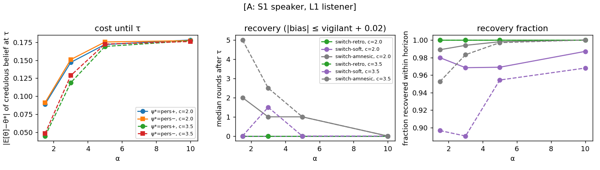

*Cost until τ and recovery vs α.*

### False-alarm cost (ψ* = inf, conditional on having switched)

| c | alpha | switch_type | false-alarm rate | n_switched | median_tau | |bias| cred @150 | |bias| vig @150 | |bias| switch @150 | std cred @150 | std switch @150 | mean |bias| cred, t≥τ | mean |bias| switch, t≥τ |
|---|---|---|---|---|---|---|---|---|---|---|---|---|
| 2 | 1.5 | amnesic | 0.198 | 99 | 15 | 0.002 | 0.003 | 0.004 | 0.005 | 0.009 | 0.016 | 0.028 |
| 2 | 1.5 | retro | 0.198 | 99 | 15 | 0.002 | 0.003 | 0.003 | 0.005 | 0.006 | 0.016 | 0.018 |
| 2 | 1.5 | soft | 0.198 | 99 | 15 | 0.002 | 0.003 | 0.003 | 0.005 | 0.005 | 0.016 | 0.016 |
| 2 | 3 | amnesic | 0.194 | 97 | 13 | 0.000 | 0.000 | 0.001 | 0.001 | 0.003 | 0.008 | 0.020 |
| 2 | 3 | retro | 0.194 | 97 | 13 | 0.000 | 0.000 | 0.000 | 0.001 | 0.001 | 0.008 | 0.009 |
| 2 | 3 | soft | 0.194 | 97 | 13 | 0.000 | 0.000 | 0.000 | 0.001 | 0.001 | 0.008 | 0.009 |
| 2 | 5 | amnesic | 0.232 | 116 | 9 | 0.000 | 0.000 | 0.003 | 0.001 | 0.005 | 0.009 | 0.021 |
| 2 | 5 | retro | 0.232 | 116 | 9 | 0.000 | 0.000 | 0.000 | 0.001 | 0.001 | 0.009 | 0.009 |
| 2 | 5 | soft | 0.232 | 116 | 9 | 0.000 | 0.000 | 0.000 | 0.001 | 0.001 | 0.009 | 0.009 |
| 2 | 10 | amnesic | 0.210 | 105 | 11 | 0.000 | 0.000 | 0.002 | 0.001 | 0.003 | 0.006 | 0.018 |
| 2 | 10 | retro | 0.210 | 105 | 11 | 0.000 | 0.000 | 0.000 | 0.001 | 0.001 | 0.006 | 0.006 |
| 2 | 10 | soft | 0.210 | 105 | 11 | 0.000 | 0.000 | 0.000 | 0.001 | 0.001 | 0.006 | 0.006 |
| 3.5 | 1.5 | amnesic | 0.002 | 1 | 9 | 0.000 | 0.000 | 0.000 | 0.000 | 0.000 | 0.067 | 0.066 |
| 3.5 | 1.5 | retro | 0.002 | 1 | 9 | 0.000 | 0.000 | 0.000 | 0.000 | 0.000 | 0.067 | 0.069 |
| 3.5 | 1.5 | soft | 0.002 | 1 | 9 | 0.000 | 0.000 | 0.000 | 0.000 | 0.000 | 0.067 | 0.074 |
| 3.5 | 3 | amnesic | 0.004 | 2 | 54 | 0.000 | 0.000 | 0.000 | 0.000 | 0.006 | 0.001 | 0.028 |
| 3.5 | 3 | retro | 0.004 | 2 | 54 | 0.000 | 0.000 | 0.000 | 0.000 | 0.000 | 0.001 | 0.007 |
| 3.5 | 3 | soft | 0.004 | 2 | 54 | 0.000 | 0.000 | 0.000 | 0.000 | 0.000 | 0.001 | 0.001 |
| 3.5 | 5 | amnesic | 0.082 | 41 | 1 | 0.000 | 0.000 | 0.000 | 0.001 | 0.001 | 0.013 | 0.015 |
| 3.5 | 5 | retro | 0.082 | 41 | 1 | 0.000 | 0.000 | 0.000 | 0.001 | 0.001 | 0.013 | 0.013 |
| 3.5 | 5 | soft | 0.082 | 41 | 1 | 0.000 | 0.000 | 0.000 | 0.001 | 0.001 | 0.013 | 0.013 |
| 3.5 | 10 | amnesic | 0.044 | 22 | 10.5 | 0.000 | 0.000 | 0.000 | 0.001 | 0.001 | 0.006 | 0.015 |
| 3.5 | 10 | retro | 0.044 | 22 | 10.5 | 0.000 | 0.000 | 0.000 | 0.001 | 0.001 | 0.006 | 0.006 |
| 3.5 | 10 | soft | 0.044 | 22 | 10.5 | 0.000 | 0.000 | 0.000 | 0.001 | 0.001 | 0.006 | 0.006 |
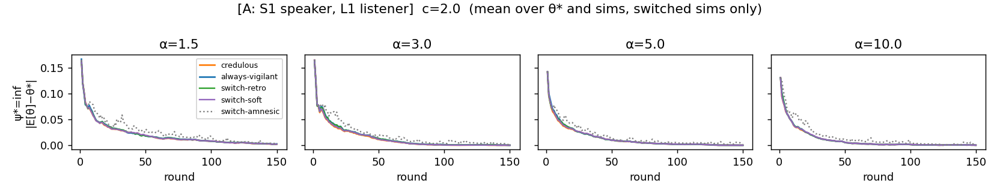

*ψ*=inf, sims that switched: |bias| by round, c=2.0.*

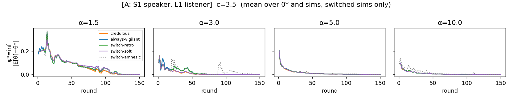

*ψ*=inf, sims that switched: |bias| by round, c=3.5.*

### Utterance frequency by round

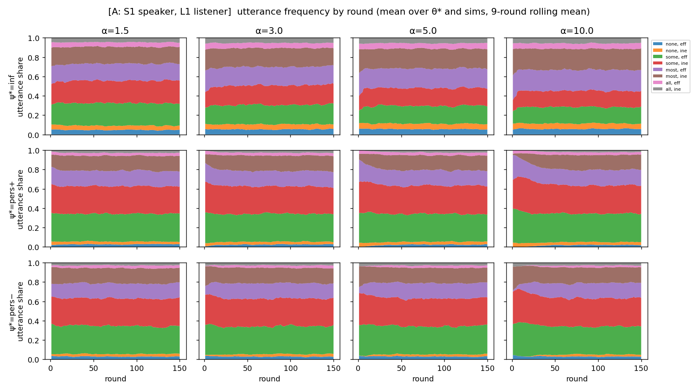

*Utterance share by round (rows ψ*, columns α), pooled over θ*.*

Share of rounds using a `some` utterance, by round block:

```
block            1-10  11-50  51-150
psi_star alpha                      
inf      1.5    0.432  0.462   0.467
         3.0    0.354  0.396   0.405
         5.0    0.322  0.368   0.370
         10.0   0.286  0.338   0.338
pers+    1.5    0.581  0.571   0.573
         3.0    0.617  0.583   0.570
         5.0    0.628  0.598   0.579
         10.0   0.671  0.632   0.586
pers−    1.5    0.589  0.574   0.574
         3.0    0.627  0.578   0.575
         5.0    0.642  0.596   0.577
         10.0   0.677  0.626   0.582
```


## 3. Experiment B — S2 modelling the switching L1 (feedback)

**Finding.** Moving to an S2 speaker changes the conclusion of Experiment A. The
retrospective switch still recovers *exactly* the always-vigilant belief from τ on — the
identity is about a listener and a stream, not about how the stream was produced, so it
survives the speaker adapting (checked at 0.0 across all 10,800 runs). What no longer
survives is the claim that vigilance is cheap. At α=10 the S2 drives the always-vigilant
listener to |E[θ]−θ*| = 0.039 at round 150, almost six times the 0.007 it managed against
the S1 speaker of Experiment A. And at round 50 the ordering has collapsed altogether: the
switching listener sits at 0.112 and the always-vigilant one at 0.113, both *worse* than
the credulous listener they were supposed to improve on (0.106).

**But the feedback loop is not what does this**, and that is worth stating before anything
else, because it is the natural misreading of this study. Experiment C1 runs the same S2
against the same detector with the loop *open* — its internal listener is a fixed
always-vigilant L1 that knows nothing about any detector — and it degrades the vigilant
listener just as much, to 0.043 at α=10 against B's 0.039, if anything slightly more. The
damage comes from the speaker having one more level of recursion, not from its modelling the
switch. Everything below that looks like strategic adaptation has to survive that control,
and mostly does not.

**Retro versus soft is the headline, and retro wins everywhere.** At round 150 and c=3.5,
retrospective sits at 0.008/0.009/0.039 (α = 1.5/3/10) against soft's 0.016/0.015/0.045 —
a factor of two at low α, narrowing at high α where both are swamped by the speaker's
adaptation. Retrospective also matches the always-vigilant listener to the third decimal at
every α (0.007/0.009/0.039), while soft does not. The gap is wider here than in Experiment
A at the same c, which is the feedback effect working against soft: the credulous
θ-marginal that soft inherits was shaped by a speaker optimising against the very listener
that will inherit it.

**The trade-off is front-loaded, but not for the reason the spec expected.** The persuasive
S2 does lean persuasive early and inform later: the probability its policy puts on the
utterance a credulous-modelling S2 would choose falls from 0.50 in rounds 1–5 to 0.37 by
rounds 51–150 at α=10, while the informative reference holds near 0.29, and at α=3 the lean
(0.42 versus 0.29) disappears entirely by round 50. But this is not boundary avoidance. At
α=1.5 the lean has already collapsed by round 25, when only 5% of runs have switched and the
boundary is nowhere near. The mechanism is the listener's belief sharpening: once a listener
is confident, E_L1[θ|u] barely moves with u, the persuasiveness term flattens, and the
policy decays toward uniform over the true utterances. The tell is that the probability on
the *chosen* utterance converges to 0.315 ≈ 1/3 at α ≤ 3, which is what a uniform choice
among about three true utterances gives. The speaker goes quiet because it has run out of
leverage, not because it is hiding.

**Boundary-hugging is survivorship, not strategy.** Sus(t) averaged over the runs that have
not yet switched does track the boundary from below and converge onto it, exactly as the
spec predicted. That figure is not evidence of anything: conditioning on "has not crossed
yet" selects the runs whose statistic stayed under the boundary, so the survivor mean must
lie below it whatever the speaker does. The selection-free test is the *unconditional*
first-crossing rate against C1's non-adaptive speaker at matched cells, and it comes out
flat — a mean difference of −0.003 ± 0.007 over 120 matched persuasive cells, with median τ
indistinguishable too (44.4 versus 46.2 rounds at α=1.5, 2.3 versus 2.6 at α=10). The
speaker that models the detector is detected neither less often nor later than the speaker
that does not. `experiments/switching/compare_hugging.py` runs this test.

The reason is structural, and it is a limitation of the design rather than a result about
persuasion: `peek` shows the speaker the *consequence* of tripping the detector — a
candidate that would trigger returns the discounted vigilant marginal, which scores lower —
but the speaker maximises a one-round utility, so it can never trade a small loss now for
staying undetected later. Modelling the detector one step ahead is not enough to produce
evasion; that would need a speaker that plans over the horizon.

**Under an honest S2 the detector fails outright at high α, and this is the most important
caveat in the study.** The listener models S1-inf, so an honest S2-inf is already
misspecified for it, and the resulting alarm rate is a level-mismatch rate rather than a
false-alarm rate. At c=3.5 it runs at 0.3% at α=1.5, 40% at α=3 and **100%** at α=10, with
median τ of 6 rounds. At α=10 the detector therefore fires on every run whether the speaker
is persuasive or scrupulously honest: measured power of 92% against pers+ and pers− is not
discrimination at that α, because the honest rate is 100% too. The statistic answers "is my
S1-inf model wrong?", and one extra level of speaker reasoning is enough to make the answer
yes. Any deployment would have to either model the speaker's depth or accept that it cannot
tell a persuader from a deeper cooperator.

Replica check (S2's internal listener vs. the actual listener): max |replica - actual| theta-marginal over all rounds and sims: 0.000e+00

### Belief trajectories

![E[θ] by round, rows (ψ*, switch type), columns θ*; α=3.0, c=2.0.](../switching_B/analysis/B2_panels_c2.0_alpha3.0.png)

*E[θ] by round, rows (ψ*, switch type), columns θ*; α=3.0, c=2.0.*

![E[θ] by round, rows (ψ*, switch type), columns θ*; α=10.0, c=2.0.](../switching_B/analysis/B2_panels_c2.0_alpha10.0.png)

*E[θ] by round, rows (ψ*, switch type), columns θ*; α=10.0, c=2.0.*

![E[θ] by round, rows (ψ*, switch type), columns θ*; α=3.0, c=3.5.](../switching_B/analysis/B2_panels_c3.5_alpha3.0.png)

*E[θ] by round, rows (ψ*, switch type), columns θ*; α=3.0, c=3.5.*

![E[θ] by round, rows (ψ*, switch type), columns θ*; α=10.0, c=3.5.](../switching_B/analysis/B2_panels_c3.5_alpha10.0.png)

*E[θ] by round, rows (ψ*, switch type), columns θ*; α=10.0, c=3.5.*

Other panels: [c=2.0, α=1.5](../switching_B/analysis/B2_panels_c2.0_alpha1.5.png), [c=2.0, α=3.0](../switching_B/analysis/B2_panels_c2.0_alpha3.0.png), [c=2.0, α=10.0](../switching_B/analysis/B2_panels_c2.0_alpha10.0.png), [c=3.5, α=1.5](../switching_B/analysis/B2_panels_c3.5_alpha1.5.png), [c=3.5, α=3.0](../switching_B/analysis/B2_panels_c3.5_alpha3.0.png), [c=3.5, α=10.0](../switching_B/analysis/B2_panels_c3.5_alpha10.0.png)

![|E[θ]−θ*| by round, mean over θ* and sims, c=2.0.](../switching_B/analysis/B2_bias_c2.0.png)

*|E[θ]−θ*| by round, mean over θ* and sims, c=2.0.*

![|E[θ]−θ*| by round, mean over θ* and sims, c=3.5.](../switching_B/analysis/B2_bias_c3.5.png)

*|E[θ]−θ*| by round, mean over θ* and sims, c=3.5.*

### Per-round speaker choice (trade-off)

`went persuasive` = the chosen utterance is the top choice of a Fang-S2 modelling a *credulous* L1 and not the top choice of S2-inf; `went informative` = the reverse; the two references coincide on a large share of rounds (grey in the CSV). Margin = (Sus(t−1) − boundary(t−1)) / boundary(t−1), pre-switch rounds only.

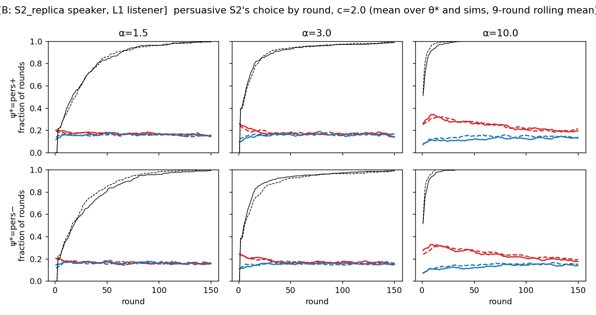

*Choice by round, c=2.0.*

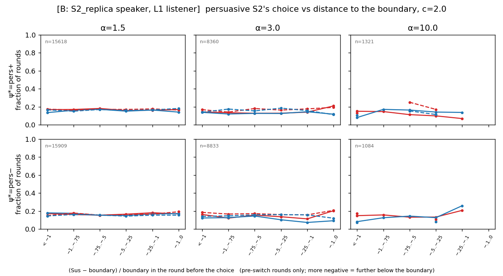

*Choice vs. distance to the boundary, c=2.0.*

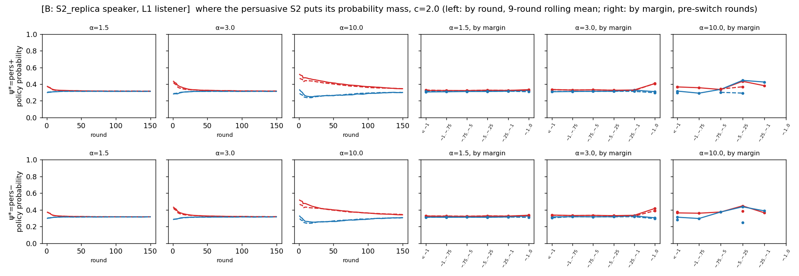

*Policy probability on each reference utterance, c=2.0. The continuous version of the same trade-off, and the readable one at low α where the speaker's softmax is too diffuse for an argmax to mean much.*

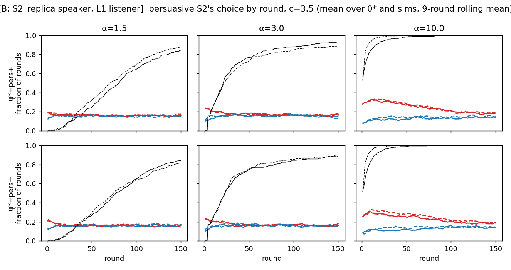

*Choice by round, c=3.5.*

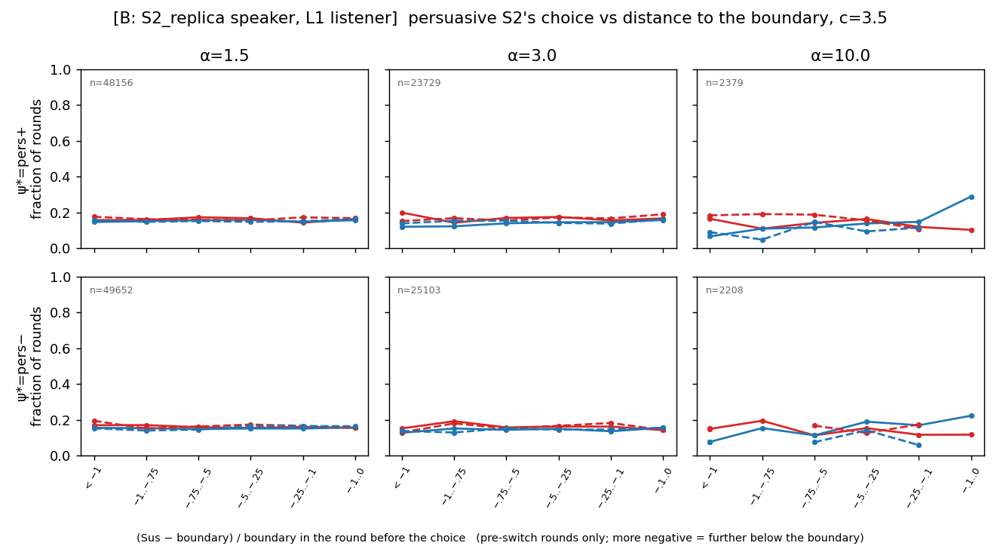

*Choice vs. distance to the boundary, c=3.5.*

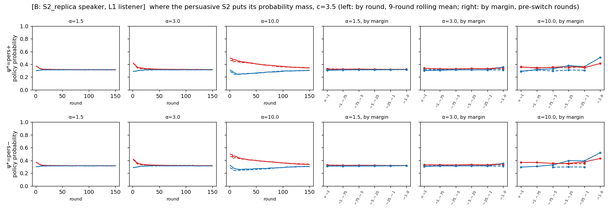

*Policy probability on each reference utterance, c=3.5. The continuous version of the same trade-off, and the readable one at low α where the speaker's softmax is too diffuse for an argmax to mean much.*

Fractions by round block (c=3.5):

| psi_star | alpha | switch_type | block | went persuasive | went informative | pers = inf | P(switched) |
|---|---|---|---|---|---|---|---|
| pers+ | 1.5 | retro | 1-5 | 0.190 | 0.123 | 0.179 | 0.000 |
| pers+ | 1.5 | retro | 6-10 | 0.161 | 0.165 | 0.159 | 0.005 |
| pers+ | 1.5 | retro | 11-25 | 0.171 | 0.160 | 0.153 | 0.048 |
| pers+ | 1.5 | retro | 26-50 | 0.167 | 0.153 | 0.153 | 0.170 |
| pers+ | 1.5 | retro | 51-150 | 0.159 | 0.157 | 0.160 | 0.614 |
| pers+ | 1.5 | soft | 1-5 | 0.195 | 0.137 | 0.162 | 0.000 |
| pers+ | 1.5 | soft | 6-10 | 0.191 | 0.157 | 0.139 | 0.007 |
| pers+ | 1.5 | soft | 11-25 | 0.174 | 0.156 | 0.150 | 0.046 |
| pers+ | 1.5 | soft | 26-50 | 0.163 | 0.160 | 0.151 | 0.221 |
| pers+ | 1.5 | soft | 51-150 | 0.161 | 0.155 | 0.157 | 0.665 |
| pers+ | 3 | retro | 1-5 | 0.238 | 0.103 | 0.170 | 0.065 |
| pers+ | 3 | retro | 6-10 | 0.212 | 0.123 | 0.151 | 0.217 |
| pers+ | 3 | retro | 11-25 | 0.196 | 0.153 | 0.145 | 0.431 |
| pers+ | 3 | retro | 26-50 | 0.177 | 0.162 | 0.148 | 0.700 |
| pers+ | 3 | retro | 51-150 | 0.168 | 0.159 | 0.154 | 0.874 |
| pers+ | 3 | soft | 1-5 | 0.236 | 0.113 | 0.179 | 0.061 |
| pers+ | 3 | soft | 6-10 | 0.211 | 0.178 | 0.139 | 0.208 |
| pers+ | 3 | soft | 11-25 | 0.188 | 0.151 | 0.147 | 0.421 |
| pers+ | 3 | soft | 26-50 | 0.171 | 0.162 | 0.154 | 0.657 |
| pers+ | 3 | soft | 51-150 | 0.167 | 0.155 | 0.156 | 0.838 |
| pers+ | 10 | retro | 1-5 | 0.279 | 0.081 | 0.227 | 0.645 |
| pers+ | 10 | retro | 6-10 | 0.326 | 0.097 | 0.178 | 0.806 |
| pers+ | 10 | retro | 11-25 | 0.315 | 0.115 | 0.139 | 0.907 |
| pers+ | 10 | retro | 26-50 | 0.291 | 0.122 | 0.134 | 0.966 |
| pers+ | 10 | retro | 51-150 | 0.214 | 0.135 | 0.155 | 0.994 |
| pers+ | 10 | soft | 1-5 | 0.279 | 0.077 | 0.211 | 0.725 |
| pers+ | 10 | soft | 6-10 | 0.321 | 0.117 | 0.119 | 0.912 |
| pers+ | 10 | soft | 11-25 | 0.323 | 0.133 | 0.118 | 0.973 |
| pers+ | 10 | soft | 26-50 | 0.304 | 0.146 | 0.110 | 0.994 |
| pers+ | 10 | soft | 51-150 | 0.218 | 0.148 | 0.145 | 1.000 |
| pers− | 1.5 | retro | 1-5 | 0.209 | 0.125 | 0.171 | 0.000 |
| pers− | 1.5 | retro | 6-10 | 0.187 | 0.151 | 0.161 | 0.005 |
| pers− | 1.5 | retro | 11-25 | 0.165 | 0.159 | 0.154 | 0.049 |
| pers− | 1.5 | retro | 26-50 | 0.156 | 0.158 | 0.169 | 0.185 |
| pers− | 1.5 | retro | 51-150 | 0.160 | 0.156 | 0.158 | 0.617 |
| pers− | 1.5 | soft | 1-5 | 0.223 | 0.112 | 0.173 | 0.000 |
| pers− | 1.5 | soft | 6-10 | 0.179 | 0.163 | 0.159 | 0.003 |
| pers− | 1.5 | soft | 11-25 | 0.172 | 0.156 | 0.148 | 0.042 |
| pers− | 1.5 | soft | 26-50 | 0.167 | 0.159 | 0.150 | 0.197 |
| pers− | 1.5 | soft | 51-150 | 0.162 | 0.164 | 0.154 | 0.615 |
| pers− | 3 | retro | 1-5 | 0.231 | 0.103 | 0.176 | 0.069 |
| pers− | 3 | retro | 6-10 | 0.195 | 0.143 | 0.149 | 0.203 |
| pers− | 3 | retro | 11-25 | 0.196 | 0.163 | 0.147 | 0.403 |
| pers− | 3 | retro | 26-50 | 0.168 | 0.159 | 0.153 | 0.667 |
| pers− | 3 | retro | 51-150 | 0.165 | 0.161 | 0.157 | 0.830 |
| pers− | 3 | soft | 1-5 | 0.231 | 0.120 | 0.202 | 0.065 |
| pers− | 3 | soft | 6-10 | 0.211 | 0.159 | 0.127 | 0.214 |
| pers− | 3 | soft | 11-25 | 0.201 | 0.154 | 0.133 | 0.397 |
| pers− | 3 | soft | 26-50 | 0.173 | 0.170 | 0.150 | 0.686 |
| pers− | 3 | soft | 51-150 | 0.162 | 0.158 | 0.156 | 0.845 |
| pers− | 10 | retro | 1-5 | 0.252 | 0.083 | 0.255 | 0.611 |
| pers− | 10 | retro | 6-10 | 0.318 | 0.112 | 0.162 | 0.788 |
| pers− | 10 | retro | 11-25 | 0.284 | 0.115 | 0.147 | 0.914 |
| pers− | 10 | retro | 26-50 | 0.259 | 0.112 | 0.146 | 0.979 |
| pers− | 10 | retro | 51-150 | 0.208 | 0.136 | 0.154 | 0.998 |
| pers− | 10 | soft | 1-5 | 0.251 | 0.070 | 0.209 | 0.713 |
| pers− | 10 | soft | 6-10 | 0.322 | 0.095 | 0.135 | 0.913 |
| pers− | 10 | soft | 11-25 | 0.319 | 0.125 | 0.111 | 0.977 |
| pers− | 10 | soft | 26-50 | 0.291 | 0.142 | 0.109 | 0.997 |
| pers− | 10 | soft | 51-150 | 0.227 | 0.145 | 0.138 | 1.000 |
### Sus(t) against the boundary, retro vs soft

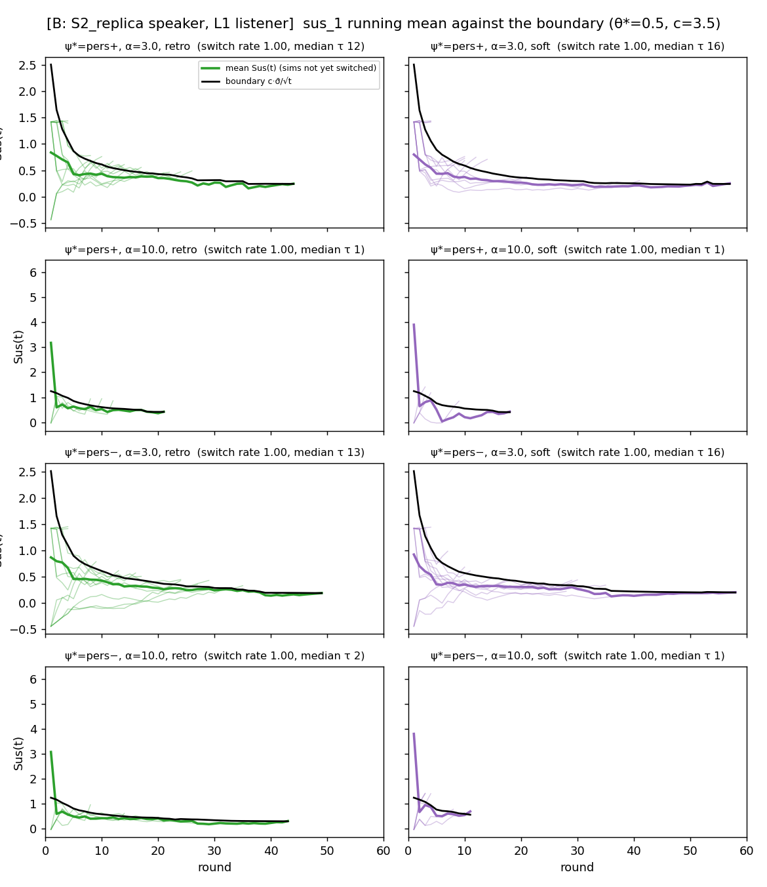

*Running mean Sus(t) (thin: 12 sims; thick: mean over sims not yet switched) and the boundary; θ*=0.5, c=3.5.*

### Achieved persuasion

|E[θ]−θ*| of the actual listener at round 25 (averaged over θ* and sims):

```
who                 always-vigilant (retro sims)  always-vigilant (soft sims)  credulous (retro sims)  credulous (soft sims)  switch-retro  switch-soft
c   psi_star alpha                                                                                                                                     
2.0 pers+    1.5                           0.051                        0.044                   0.065                  0.057         0.056        0.053
             3.0                           0.050                        0.055                   0.077                  0.078         0.051        0.065
             10.0                          0.141                        0.126                   0.115                  0.098         0.142        0.144
    pers−    1.5                           0.043                        0.047                   0.055                  0.063         0.047        0.059
             3.0                           0.053                        0.054                   0.079                  0.078         0.053        0.065
             10.0                          0.150                        0.128                   0.120                  0.108         0.150        0.149
3.5 pers+    1.5                           0.047                        0.047                   0.059                  0.062         0.057        0.062
             3.0                           0.050                        0.049                   0.075                  0.075         0.057        0.073
             10.0                          0.149                        0.129                   0.112                  0.103         0.149        0.149
    pers−    1.5                           0.043                        0.045                   0.059                  0.061         0.058        0.061
             3.0                           0.052                        0.046                   0.078                  0.073         0.058        0.070
             10.0                          0.138                        0.144                   0.106                  0.107         0.139        0.159
```

|E[θ]−θ*| of the actual listener at round 50 (averaged over θ* and sims):

```
who                 always-vigilant (retro sims)  always-vigilant (soft sims)  credulous (retro sims)  credulous (soft sims)  switch-retro  switch-soft
c   psi_star alpha                                                                                                                                     
2.0 pers+    1.5                           0.032                        0.028                   0.048                  0.042         0.034        0.035
             3.0                           0.031                        0.033                   0.061                  0.060         0.031        0.040
             10.0                          0.112                        0.102                   0.114                  0.096         0.112        0.116
    pers−    1.5                           0.027                        0.027                   0.039                  0.043         0.028        0.036
             3.0                           0.035                        0.033                   0.063                  0.061         0.035        0.040
             10.0                          0.117                        0.094                   0.118                  0.102         0.117        0.114
3.5 pers+    1.5                           0.029                        0.027                   0.043                  0.044         0.036        0.042
             3.0                           0.031                        0.028                   0.059                  0.061         0.030        0.047
             10.0                          0.117                        0.100                   0.110                  0.099         0.117        0.115
    pers−    1.5                           0.028                        0.028                   0.042                  0.047         0.039        0.046
             3.0                           0.029                        0.028                   0.062                  0.059         0.030        0.047
             10.0                          0.108                        0.115                   0.103                  0.106         0.108        0.128
```

|E[θ]−θ*| of the actual listener at round 100 (averaged over θ* and sims):

```
who                 always-vigilant (retro sims)  always-vigilant (soft sims)  credulous (retro sims)  credulous (soft sims)  switch-retro  switch-soft
c   psi_star alpha                                                                                                                                     
2.0 pers+    1.5                           0.014                        0.012                   0.032                  0.029         0.014        0.016
             3.0                           0.018                        0.015                   0.052                  0.049         0.018        0.020
             10.0                          0.071                        0.058                   0.107                  0.087         0.071        0.067
    pers−    1.5                           0.013                        0.013                   0.028                  0.029         0.014        0.018
             3.0                           0.015                        0.016                   0.053                  0.050         0.015        0.021
             10.0                          0.065                        0.057                   0.105                  0.092         0.065        0.068
3.5 pers+    1.5                           0.013                        0.013                   0.029                  0.029         0.016        0.023
             3.0                           0.017                        0.014                   0.050                  0.052         0.015        0.023
             10.0                          0.065                        0.059                   0.100                  0.088         0.065        0.067
    pers−    1.5                           0.014                        0.014                   0.027                  0.034         0.015        0.029
             3.0                           0.016                        0.015                   0.051                  0.051         0.015        0.026
             10.0                          0.067                        0.067                   0.096                  0.098         0.067        0.076
```

|E[θ]−θ*| of the actual listener at round 150 (averaged over θ* and sims):

```
who                 always-vigilant (retro sims)  always-vigilant (soft sims)  credulous (retro sims)  credulous (soft sims)  switch-retro  switch-soft
c   psi_star alpha                                                                                                                                     
2.0 pers+    1.5                           0.006                        0.006                   0.025                  0.024         0.006        0.009
             3.0                           0.009                        0.009                   0.049                  0.047         0.009        0.012
             10.0                          0.042                        0.038                   0.093                  0.077         0.042        0.044
    pers−    1.5                           0.007                        0.008                   0.020                  0.024         0.007        0.010
             3.0                           0.006                        0.008                   0.048                  0.048         0.006        0.013
             10.0                          0.035                        0.037                   0.091                  0.080         0.035        0.045
3.5 pers+    1.5                           0.008                        0.007                   0.021                  0.022         0.008        0.016
             3.0                           0.010                        0.008                   0.046                  0.050         0.009        0.015
             10.0                          0.040                        0.036                   0.088                  0.077         0.039        0.042
    pers−    1.5                           0.007                        0.006                   0.021                  0.025         0.008        0.017
             3.0                           0.009                        0.007                   0.047                  0.047         0.009        0.015
             10.0                          0.039                        0.042                   0.083                  0.084         0.039        0.048
```

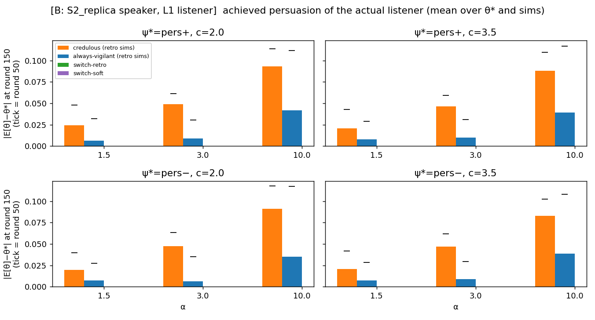

*Achieved persuasion at round 150 (bars) and 50 (ticks).*

### Level-mismatch alarm rate under S2-inf

The actual listener models S1-inf; the honest speaker is an S2-inf. These are not false-alarm rates of a correctly specified test: they are *level-mismatch* rates.

| c | switch_type | alpha | alarm rate | median τ | n |
|---|---|---|---|---|---|
| 2 | retro | 1.5 | 0.210 | 29 | 300 |
| 2 | retro | 3 | 0.740 | 29.5 | 300 |
| 2 | retro | 10 | 1.000 | 4 | 300 |
| 2 | soft | 1.5 | 0.253 | 37 | 300 |
| 2 | soft | 3 | 0.767 | 29 | 300 |
| 2 | soft | 10 | 1.000 | 4 | 300 |
| 3.5 | retro | 1.5 | 0.003 | 117 | 300 |
| 3.5 | retro | 3 | 0.400 | 73 | 300 |
| 3.5 | retro | 10 | 1.000 | 6 | 300 |
| 3.5 | soft | 1.5 | 0.007 | 101 | 300 |
| 3.5 | soft | 3 | 0.407 | 85.5 | 300 |
| 3.5 | soft | 10 | 0.997 | 6 | 300 |
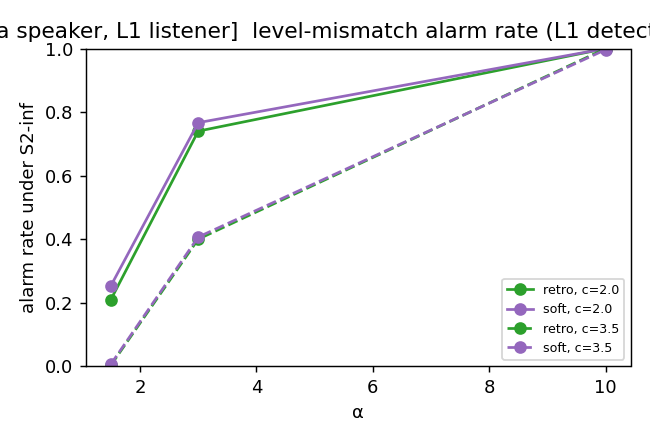

*Level-mismatch alarm rate vs α.*


## 4. Experiment C1 — S2 modelling Fang's vigilant L1-strat, switching L1 (offline)

**Finding.** C1 is the control that reinterprets Experiment B. The speaker is the same
Fang-form S2, but its internal listener is a fixed always-vigilant L1 that contains no
detector and no switch, so the loop is open and the whole utterance set is generated once
and replayed. Everything B showed survives here, which means none of it required the
feedback:

| quantity (c=3.5, α=10) | B (models the switching listener) | C1 (models a fixed vigilant L1) |
|---|---|---|
| always-vigilant \|bias\| at round 150 | 0.039 | 0.043 |
| retrospective \|bias\| at round 150 | 0.039 | 0.043 |
| crossing rate, ψ*=pers+ | 0.998 | 1.000 |
| level-mismatch rate, ψ*=inf | 1.000 | 0.980 |

The vigilant listener is degraded just as much by a speaker that has never heard of the
detector. The arms-race effect in this project is therefore an effect of *recursion depth*
— an S2 reasoning about a vigilant L1 can bias it — and not of the speaker tracking the
listener's switch. Combined with the flat crossing-rate comparison reported under
Experiment B, the closed loop contributes nothing measurable at this planning horizon.

**The switch ordering is unchanged.** Retrospective matches the always-vigilant listener to
three decimals at every α (0.006/0.009/0.044 against 0.006/0.010/0.044), soft trails
(0.015/0.017/0.049) and amnesic trails differently (0.021/0.014/0.049) — the same ranking,
and the same crossover between soft and amnesic around α=3, as in Experiment A. That the
ordering is invariant across an S1 speaker, an open-loop S2 and a closed-loop S2 is the
strongest evidence in the study that it is a property of the switch mechanism rather than of
any particular opponent.

**Level mismatch is again the dominant failure mode.** Against an honest S2-inf the L1
detector fires on 0.7% of runs at α=1.5, 27.7% at α=3 and 98.0% at α=10. The listener is
detecting that its S1-inf model is wrong, which it is, for a reason that has nothing to do
with persuasion. At α=10 the ψ*=inf and ψ*=pers+ rates are 0.98 and 1.00: the test has no
discriminating power left at all. C2 is the study that isolates this, by giving the detector
the right level to begin with.

### Splice identity check

```
Retrospective switch identity, checked on the stored trajectories
(16200 (sim, c, switch_type) runs, 13092 of which switched):
  max |E_switch - E_cred| over rounds t <  tau : 0.000e+00
  max |E_switch - E_vig|  over rounds t >= tau : 0.000e+00
E[theta] columns are stored as float32; 0.0 is bit-identical agreement.
```

### τ distribution

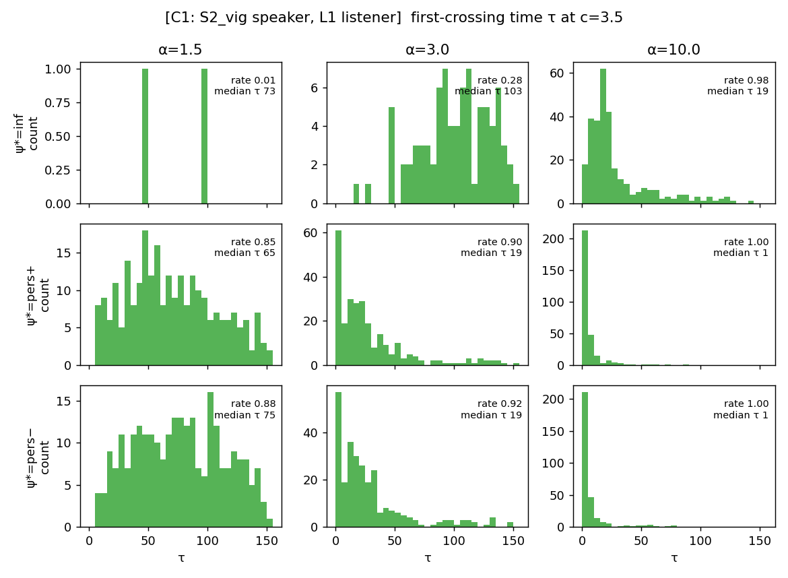

*First-crossing time τ at c=3.5 (rows ψ*, columns α).*

### Belief trajectories (Fang-style panels)

![E[θ] by round, rows ψ*, columns θ*; α=3.0, c=2.0. Red dashed = θ*.](../switching_C1/analysis/C12_panels_c2.0_alpha3.0.png)

*E[θ] by round, rows ψ*, columns θ*; α=3.0, c=2.0. Red dashed = θ*.*

![E[θ] by round, rows ψ*, columns θ*; α=10.0, c=2.0. Red dashed = θ*.](../switching_C1/analysis/C12_panels_c2.0_alpha10.0.png)

*E[θ] by round, rows ψ*, columns θ*; α=10.0, c=2.0. Red dashed = θ*.*

![E[θ] by round, rows ψ*, columns θ*; α=3.0, c=3.5. Red dashed = θ*.](../switching_C1/analysis/C12_panels_c3.5_alpha3.0.png)

*E[θ] by round, rows ψ*, columns θ*; α=3.0, c=3.5. Red dashed = θ*.*

![E[θ] by round, rows ψ*, columns θ*; α=10.0, c=3.5. Red dashed = θ*.](../switching_C1/analysis/C12_panels_c3.5_alpha10.0.png)

*E[θ] by round, rows ψ*, columns θ*; α=10.0, c=3.5. Red dashed = θ*.*

Other (c, α) panels: [c=2.0, α=1.5](../switching_C1/analysis/C12_panels_c2.0_alpha1.5.png), [c=2.0, α=3.0](../switching_C1/analysis/C12_panels_c2.0_alpha3.0.png), [c=2.0, α=10.0](../switching_C1/analysis/C12_panels_c2.0_alpha10.0.png), [c=3.5, α=1.5](../switching_C1/analysis/C12_panels_c3.5_alpha1.5.png), [c=3.5, α=3.0](../switching_C1/analysis/C12_panels_c3.5_alpha3.0.png), [c=3.5, α=10.0](../switching_C1/analysis/C12_panels_c3.5_alpha10.0.png)

### |bias| and std over rounds

![|E[θ]−θ*| by round, mean over θ* and sims, c=2.0.](../switching_C1/analysis/C12_bias_c2.0.png)

*|E[θ]−θ*| by round, mean over θ* and sims, c=2.0.*

![std[θ] by round, mean over θ* and sims, c=2.0.](../switching_C1/analysis/C12_std_c2.0.png)

*std[θ] by round, mean over θ* and sims, c=2.0.*

![|E[θ]−θ*| by round, mean over θ* and sims, c=3.5.](../switching_C1/analysis/C12_bias_c3.5.png)

*|E[θ]−θ*| by round, mean over θ* and sims, c=3.5.*

![std[θ] by round, mean over θ* and sims, c=3.5.](../switching_C1/analysis/C12_std_c3.5.png)

*std[θ] by round, mean over θ* and sims, c=3.5.*

Mean |E[θ]−θ*| over all 150 rounds (c=3.5, averaged over θ*):

```
who             always-vigilant  credulous  switch-amnesic  switch-retro  switch-soft
psi_star alpha                                                                       
inf      1.5              0.015      0.014           0.014         0.014        0.014
         3.0              0.013      0.011           0.014         0.012        0.011
         10.0             0.012      0.012           0.022         0.012        0.013
pers+    1.5              0.029      0.044           0.046         0.035        0.041
         3.0              0.035      0.065           0.044         0.036        0.049
         10.0             0.099      0.106           0.104         0.099        0.109
pers−    1.5              0.029      0.042           0.047         0.035        0.040
         3.0              0.032      0.064           0.041         0.033        0.044
         10.0             0.099      0.116           0.106         0.100        0.108
```

|E[θ]−θ*| at round 150 (c=3.5):

```
who             always-vigilant  credulous  switch-amnesic  switch-retro  switch-soft
psi_star alpha                                                                       
inf      1.5              0.002      0.002           0.002         0.002        0.002
         3.0              0.001      0.000           0.004         0.001        0.001
         10.0             0.001      0.000           0.007         0.001        0.002
pers+    1.5              0.006      0.023           0.021         0.006        0.015
         3.0              0.010      0.046           0.014         0.009        0.017
         10.0             0.044      0.089           0.049         0.044        0.049
pers−    1.5              0.008      0.021           0.021         0.009        0.014
         3.0              0.008      0.048           0.011         0.008        0.013
         10.0             0.042      0.094           0.047         0.042        0.047
```

### Cost until τ and recovery

Recovery = rounds after τ until |bias| of the switching listener ≤ |bias| of the always-vigilant listener at the same round + 0.02 (per sim; median over sims that switched; `recovery_frac` = share recovered within the horizon). For retro it is 0 by construction.

| c | psi_star | alpha | switch_type | switch rate | median τ | |bias| cred at τ | bias cred at τ | recovery (median rounds) | recovery frac | mean |bias| switch, t≥τ | mean |bias| cred, t≥τ | mean |bias| vig, t≥τ |
|---|---|---|---|---|---|---|---|---|---|---|---|---|
| 2 | pers+ | 1.5 | amnesic | 0.993 | 20 | 0.094 | 0.035 | 2 | 0.983 | 0.034 | 0.037 | 0.020 |
| 2 | pers+ | 1.5 | retro | 0.993 | 20 | 0.094 | 0.035 | 0 | 1.000 | 0.020 | 0.037 | 0.020 |
| 2 | pers+ | 1.5 | soft | 0.993 | 20 | 0.094 | 0.035 | 0 | 0.980 | 0.027 | 0.037 | 0.020 |
| 2 | pers+ | 3 | amnesic | 0.980 | 6 | 0.139 | 0.075 | 1 | 0.997 | 0.038 | 0.062 | 0.030 |
| 2 | pers+ | 3 | retro | 0.980 | 6 | 0.139 | 0.075 | 0 | 1.000 | 0.030 | 0.062 | 0.030 |
| 2 | pers+ | 3 | soft | 0.980 | 6 | 0.139 | 0.075 | 0 | 0.986 | 0.037 | 0.062 | 0.030 |
| 2 | pers+ | 10 | amnesic | 1.000 | 1 | 0.182 | 0.121 | 0 | 1.000 | 0.102 | 0.106 | 0.098 |
| 2 | pers+ | 10 | retro | 1.000 | 1 | 0.182 | 0.121 | 0 | 1.000 | 0.098 | 0.106 | 0.098 |
| 2 | pers+ | 10 | soft | 1.000 | 1 | 0.182 | 0.121 | 0 | 0.980 | 0.107 | 0.106 | 0.098 |
| 2 | pers− | 1.5 | amnesic | 0.990 | 19 | 0.102 | -0.041 | 2 | 0.993 | 0.033 | 0.036 | 0.021 |
| 2 | pers− | 1.5 | retro | 0.990 | 19 | 0.102 | -0.041 | 0 | 1.000 | 0.021 | 0.036 | 0.021 |
| 2 | pers− | 1.5 | soft | 0.990 | 19 | 0.102 | -0.041 | 0 | 0.976 | 0.028 | 0.036 | 0.021 |
| 2 | pers− | 3 | amnesic | 0.980 | 6 | 0.139 | -0.070 | 1 | 0.997 | 0.034 | 0.062 | 0.027 |
| 2 | pers− | 3 | retro | 0.980 | 6 | 0.139 | -0.070 | 0 | 1.000 | 0.027 | 0.062 | 0.027 |
| 2 | pers− | 3 | soft | 0.980 | 6 | 0.139 | -0.070 | 0 | 0.969 | 0.034 | 0.062 | 0.027 |
| 2 | pers− | 10 | amnesic | 1.000 | 1 | 0.172 | -0.115 | 0 | 1.000 | 0.104 | 0.115 | 0.099 |
| 2 | pers− | 10 | retro | 1.000 | 1 | 0.172 | -0.115 | 0 | 1.000 | 0.099 | 0.115 | 0.099 |
| 2 | pers− | 10 | soft | 1.000 | 1 | 0.172 | -0.115 | 0 | 0.980 | 0.106 | 0.115 | 0.099 |
| 3.5 | pers+ | 1.5 | amnesic | 0.850 | 65 | 0.052 | 0.021 | 4 | 0.914 | 0.050 | 0.032 | 0.013 |
| 3.5 | pers+ | 1.5 | retro | 0.850 | 65 | 0.052 | 0.021 | 0 | 1.000 | 0.013 | 0.032 | 0.013 |
| 3.5 | pers+ | 1.5 | soft | 0.850 | 65 | 0.052 | 0.021 | 0 | 0.863 | 0.027 | 0.032 | 0.013 |
| 3.5 | pers+ | 3 | amnesic | 0.897 | 19 | 0.123 | 0.077 | 3 | 0.993 | 0.041 | 0.064 | 0.025 |
| 3.5 | pers+ | 3 | retro | 0.897 | 19 | 0.123 | 0.077 | 0 | 1.000 | 0.025 | 0.064 | 0.025 |
| 3.5 | pers+ | 3 | soft | 0.897 | 19 | 0.123 | 0.077 | 2 | 0.918 | 0.043 | 0.064 | 0.025 |
| 3.5 | pers+ | 10 | amnesic | 1.000 | 1 | 0.178 | 0.119 | 0 | 0.993 | 0.103 | 0.105 | 0.098 |
| 3.5 | pers+ | 10 | retro | 1.000 | 1 | 0.178 | 0.119 | 0 | 1.000 | 0.098 | 0.105 | 0.098 |
| 3.5 | pers+ | 10 | soft | 1.000 | 1 | 0.178 | 0.119 | 0 | 0.970 | 0.107 | 0.105 | 0.098 |
| 3.5 | pers− | 1.5 | amnesic | 0.877 | 75 | 0.044 | -0.014 | 4 | 0.901 | 0.052 | 0.029 | 0.014 |
| 3.5 | pers− | 1.5 | retro | 0.877 | 75 | 0.044 | -0.014 | 0 | 1.000 | 0.014 | 0.029 | 0.014 |
| 3.5 | pers− | 1.5 | soft | 0.877 | 75 | 0.044 | -0.014 | 0 | 0.913 | 0.024 | 0.029 | 0.014 |
| 3.5 | pers− | 3 | amnesic | 0.920 | 19 | 0.114 | -0.070 | 3 | 0.986 | 0.037 | 0.062 | 0.023 |
| 3.5 | pers− | 3 | retro | 0.920 | 19 | 0.114 | -0.070 | 0 | 1.000 | 0.023 | 0.062 | 0.023 |
| 3.5 | pers− | 3 | soft | 0.920 | 19 | 0.114 | -0.070 | 1 | 0.928 | 0.037 | 0.062 | 0.023 |
| 3.5 | pers− | 10 | amnesic | 1.000 | 1 | 0.168 | -0.118 | 0 | 1.000 | 0.105 | 0.115 | 0.098 |
| 3.5 | pers− | 10 | retro | 1.000 | 1 | 0.168 | -0.118 | 0 | 1.000 | 0.098 | 0.115 | 0.098 |
| 3.5 | pers− | 10 | soft | 1.000 | 1 | 0.168 | -0.118 | 0 | 0.957 | 0.107 | 0.115 | 0.098 |
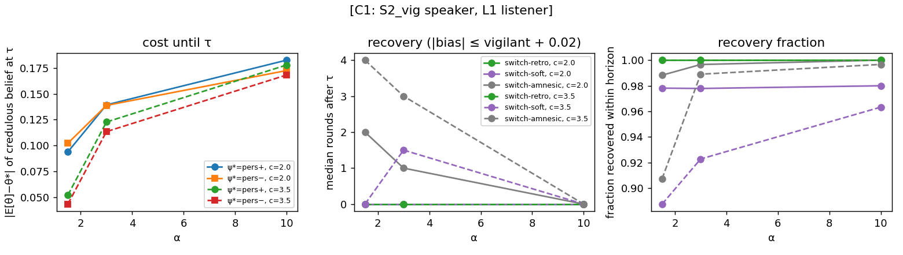

*Cost until τ and recovery vs α.*

### False-alarm cost (ψ* = inf, conditional on having switched)

| c | alpha | switch_type | false-alarm rate | n_switched | median_tau | |bias| cred @150 | |bias| vig @150 | |bias| switch @150 | std cred @150 | std switch @150 | mean |bias| cred, t≥τ | mean |bias| switch, t≥τ |
|---|---|---|---|---|---|---|---|---|---|---|---|---|
| 2 | 1.5 | amnesic | 0.153 | 46 | 17 | 0.000 | 0.001 | 0.003 | 0.002 | 0.008 | 0.008 | 0.026 |
| 2 | 1.5 | retro | 0.153 | 46 | 17 | 0.000 | 0.001 | 0.001 | 0.002 | 0.004 | 0.008 | 0.010 |
| 2 | 1.5 | soft | 0.153 | 46 | 17 | 0.000 | 0.001 | 0.000 | 0.002 | 0.002 | 0.008 | 0.009 |
| 2 | 3 | amnesic | 0.650 | 195 | 47 | 0.000 | 0.001 | 0.008 | 0.001 | 0.011 | 0.004 | 0.033 |
| 2 | 3 | retro | 0.650 | 195 | 47 | 0.000 | 0.001 | 0.001 | 0.001 | 0.003 | 0.004 | 0.006 |
| 2 | 3 | soft | 0.650 | 195 | 47 | 0.000 | 0.001 | 0.002 | 0.001 | 0.002 | 0.004 | 0.005 |
| 2 | 10 | amnesic | 0.993 | 298 | 11 | 0.000 | 0.001 | 0.003 | 0.001 | 0.005 | 0.007 | 0.017 |
| 2 | 10 | retro | 0.993 | 298 | 11 | 0.000 | 0.001 | 0.001 | 0.001 | 0.003 | 0.007 | 0.008 |
| 2 | 10 | soft | 0.993 | 298 | 11 | 0.000 | 0.001 | 0.002 | 0.001 | 0.004 | 0.007 | 0.010 |
| 3.5 | 1.5 | amnesic | 0.007 | 2 | 73 | 0.000 | 0.004 | 0.001 | 0.000 | 0.008 | 0.000 | 0.032 |
| 3.5 | 1.5 | retro | 0.007 | 2 | 73 | 0.000 | 0.004 | 0.004 | 0.000 | 0.018 | 0.000 | 0.016 |
| 3.5 | 1.5 | soft | 0.007 | 2 | 73 | 0.000 | 0.004 | 0.000 | 0.000 | 0.000 | 0.000 | 0.000 |
| 3.5 | 3 | amnesic | 0.277 | 83 | 103 | 0.001 | 0.002 | 0.015 | 0.001 | 0.020 | 0.002 | 0.048 |
| 3.5 | 3 | retro | 0.277 | 83 | 103 | 0.001 | 0.002 | 0.002 | 0.001 | 0.004 | 0.002 | 0.004 |
| 3.5 | 3 | soft | 0.277 | 83 | 103 | 0.001 | 0.002 | 0.002 | 0.001 | 0.002 | 0.002 | 0.002 |
| 3.5 | 10 | amnesic | 0.980 | 294 | 19 | 0.000 | 0.001 | 0.007 | 0.001 | 0.008 | 0.005 | 0.022 |
| 3.5 | 10 | retro | 0.980 | 294 | 19 | 0.000 | 0.001 | 0.001 | 0.001 | 0.003 | 0.005 | 0.006 |
| 3.5 | 10 | soft | 0.980 | 294 | 19 | 0.000 | 0.001 | 0.002 | 0.001 | 0.003 | 0.005 | 0.007 |
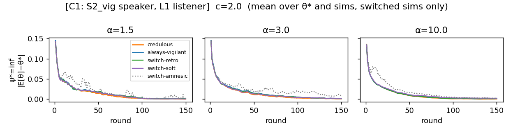

*ψ*=inf, sims that switched: |bias| by round, c=2.0.*

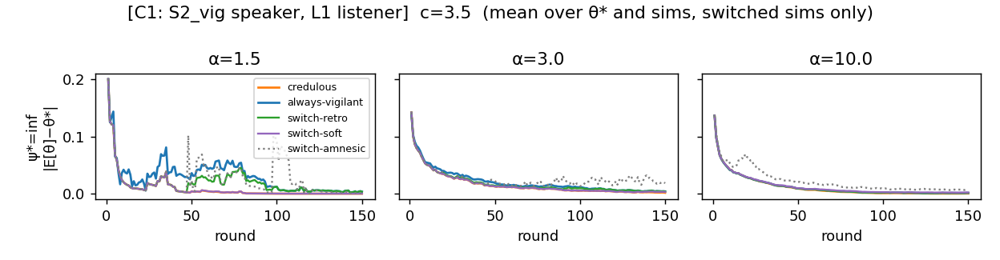

*ψ*=inf, sims that switched: |bias| by round, c=3.5.*

### Utterance frequency by round

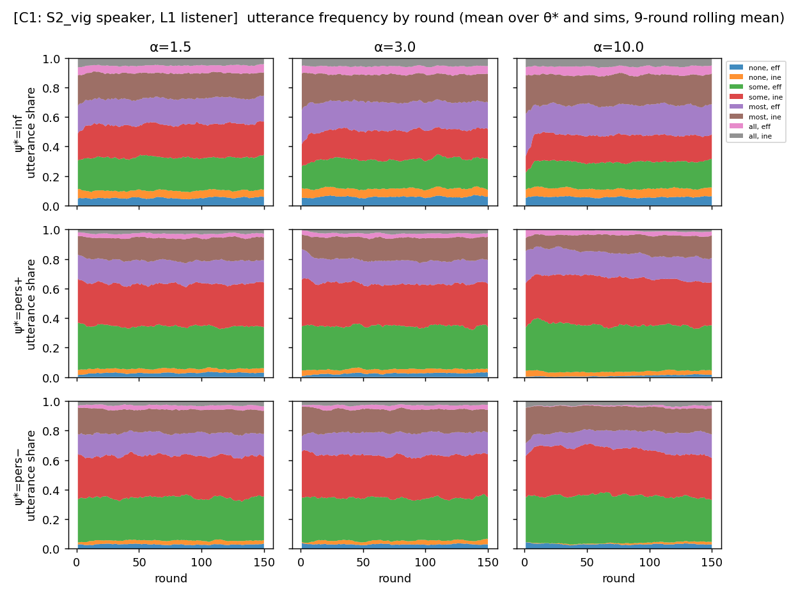

*Utterance share by round (rows ψ*, columns α), pooled over θ*.*

Share of rounds using a `some` utterance, by round block:

```
block            1-10  11-50  51-150
psi_star alpha                      
inf      1.5    0.415  0.444   0.452
         3.0    0.343  0.393   0.398
         10.0   0.283  0.366   0.362
pers+    1.5    0.600  0.575   0.575
         3.0    0.618  0.587   0.575
         10.0   0.626  0.656   0.626
pers−    1.5    0.581  0.573   0.576
         3.0    0.619  0.581   0.575
         10.0   0.621  0.660   0.621
```


## 5. Experiment C2 — S2 modelling a credulous L1, switching L2 detector (offline)

**Finding.** C2 is the properly specified null, and it settles what the level mismatch was
costing. Here the data-generating speaker is an S2 modelling a credulous L1, and the
listeners are L2s whose internal model is that same S2, so the detector's null is exactly
right. The false-alarm rate collapses from the 42–47% that B and C1 recorded at c=3.5 to
**0.2%**, and it stops depending on α altogether (0.000, 0.003, 0.003 at α = 1.5, 3, 10,
against C1's 0.007, 0.277, 0.980). Essentially the entire alarm rate those studies measured
under an honest speaker was misspecification, not false positives. Get the level right and
the test is calibrated — arguably better calibrated than the S1 case, where c=3.5 still
gives 3.3%.

**The power is the price.** Matched at the same cutoff, and pooling over θ* and α:

| | FPR (ψ*=inf) | TPR (pers+) | TPR − FPR |
|---|---|---|---|
| A — S1 speaker, L1 detector, c=2.0 | 0.208 | 0.992 | 0.784 |
| A — S1 speaker, L1 detector, c=3.5 | 0.033 | 0.928 | 0.895 |
| C2 — S2 speaker, L2 detector, c=2.0 | 0.110 | 0.771 | 0.661 |
| C2 — S2 speaker, L2 detector, c=3.5 | 0.002 | 0.547 | 0.545 |

C2 is dominated, and not by a little: at c=2.0 it buys a *lower* false-alarm rate than A
(0.110 against 0.208) and still gives up 22 points of power. Detection is simply harder one
level up. That is the prediction Fang's paper makes for the arms race — a speaker reasoning
about a smarter listener chooses less conspicuous utterances — and it shows up here as a
26–38 point drop in the separation the same statistic can achieve. Note also that C2's power
*rises* with α at c=3.5 (0.50, 0.51, 0.63) where its false-alarm rate stays flat, the
opposite of the pattern in the misspecified studies, where both rise together and meet at 1.

**Switching still pays, and the ordering still holds.** Among the runs that do alarm, the
retrospective switch again lands exactly on the always-vigilant listener's post-τ bias at
every cell (0.011/0.024/0.034 against 0.011/0.024/0.034), while soft runs 0.046–0.065 and
amnesic 0.039–0.055. The credulous bias at the moment of the alarm is larger than anywhere
else in the study (0.072–0.228, against 0.045–0.177 in Experiment A), because the alarm
comes later and a level-2 persuader is more effective in the meantime. Unconditional
round-150 numbers look weaker here (retrospective 0.020–0.031 against the always-vigilant
0.006–0.010) purely because only about half the runs ever alarm at c=3.5, so the average
is diluted by runs that stayed credulous — not because the switch works less well when it
fires.

### Splice identity check

```
Retrospective switch identity, checked on the stored trajectories
(16200 (sim, c, switch_type) runs, 7338 of which switched):
  max |E_switch - E_cred| over rounds t <  tau : 0.000e+00
  max |E_switch - E_vig|  over rounds t >= tau : 0.000e+00
E[theta] columns are stored as float32; 0.0 is bit-identical agreement.
```

### τ distribution

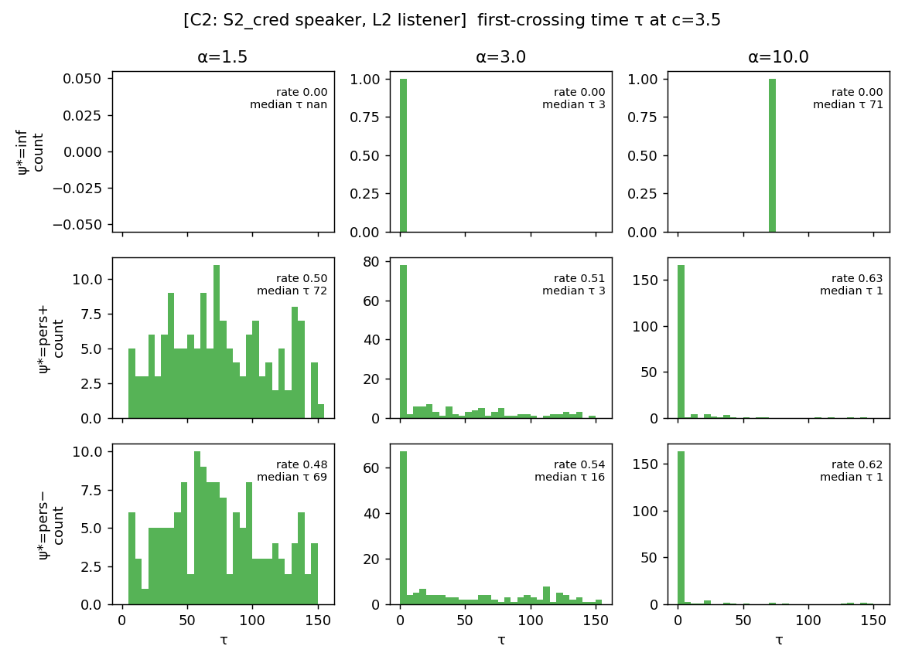

*First-crossing time τ at c=3.5 (rows ψ*, columns α).*

### Belief trajectories (Fang-style panels)

![E[θ] by round, rows ψ*, columns θ*; α=3.0, c=2.0. Red dashed = θ*.](../switching_C2/analysis/C22_panels_c2.0_alpha3.0.png)

*E[θ] by round, rows ψ*, columns θ*; α=3.0, c=2.0. Red dashed = θ*.*

![E[θ] by round, rows ψ*, columns θ*; α=10.0, c=2.0. Red dashed = θ*.](../switching_C2/analysis/C22_panels_c2.0_alpha10.0.png)

*E[θ] by round, rows ψ*, columns θ*; α=10.0, c=2.0. Red dashed = θ*.*

![E[θ] by round, rows ψ*, columns θ*; α=3.0, c=3.5. Red dashed = θ*.](../switching_C2/analysis/C22_panels_c3.5_alpha3.0.png)

*E[θ] by round, rows ψ*, columns θ*; α=3.0, c=3.5. Red dashed = θ*.*

![E[θ] by round, rows ψ*, columns θ*; α=10.0, c=3.5. Red dashed = θ*.](../switching_C2/analysis/C22_panels_c3.5_alpha10.0.png)

*E[θ] by round, rows ψ*, columns θ*; α=10.0, c=3.5. Red dashed = θ*.*

Other (c, α) panels: [c=2.0, α=1.5](../switching_C2/analysis/C22_panels_c2.0_alpha1.5.png), [c=2.0, α=3.0](../switching_C2/analysis/C22_panels_c2.0_alpha3.0.png), [c=2.0, α=10.0](../switching_C2/analysis/C22_panels_c2.0_alpha10.0.png), [c=3.5, α=1.5](../switching_C2/analysis/C22_panels_c3.5_alpha1.5.png), [c=3.5, α=3.0](../switching_C2/analysis/C22_panels_c3.5_alpha3.0.png), [c=3.5, α=10.0](../switching_C2/analysis/C22_panels_c3.5_alpha10.0.png)

### |bias| and std over rounds

![|E[θ]−θ*| by round, mean over θ* and sims, c=2.0.](../switching_C2/analysis/C22_bias_c2.0.png)

*|E[θ]−θ*| by round, mean over θ* and sims, c=2.0.*

![std[θ] by round, mean over θ* and sims, c=2.0.](../switching_C2/analysis/C22_std_c2.0.png)

*std[θ] by round, mean over θ* and sims, c=2.0.*

![|E[θ]−θ*| by round, mean over θ* and sims, c=3.5.](../switching_C2/analysis/C22_bias_c3.5.png)

*|E[θ]−θ*| by round, mean over θ* and sims, c=3.5.*

![std[θ] by round, mean over θ* and sims, c=3.5.](../switching_C2/analysis/C22_std_c3.5.png)

*std[θ] by round, mean over θ* and sims, c=3.5.*

Mean |E[θ]−θ*| over all 150 rounds (c=3.5, averaged over θ*):

```
who             always-vigilant  credulous  switch-amnesic  switch-retro  switch-soft
psi_star alpha                                                                       
inf      1.5              0.016      0.015           0.015         0.015        0.015
         3.0              0.012      0.011           0.011         0.011        0.011
         10.0             0.013      0.012           0.012         0.012        0.012
pers+    1.5              0.028      0.056           0.052         0.046        0.053
         3.0              0.031      0.072           0.053         0.049        0.058
         10.0             0.032      0.095           0.050         0.048        0.053
pers−    1.5              0.029      0.057           0.052         0.046        0.053
         3.0              0.033      0.074           0.061         0.057        0.067
         10.0             0.034      0.091           0.055         0.054        0.058
```

|E[θ]−θ*| at round 150 (c=3.5):

```
who             always-vigilant  credulous  switch-amnesic  switch-retro  switch-soft
psi_star alpha                                                                       
inf      1.5              0.001      0.001           0.001         0.001        0.001
         3.0              0.001      0.001           0.001         0.001        0.001
         10.0             0.001      0.000           0.000         0.000        0.000
pers+    1.5              0.007      0.045           0.028         0.020        0.036
         3.0              0.008      0.060           0.030         0.026        0.038
         10.0             0.006      0.068           0.025         0.024        0.029
pers−    1.5              0.007      0.043           0.026         0.020        0.033
         3.0              0.009      0.061           0.037         0.028        0.047
         10.0             0.010      0.070           0.032         0.031        0.037
```

### Cost until τ and recovery

Recovery = rounds after τ until |bias| of the switching listener ≤ |bias| of the always-vigilant listener at the same round + 0.02 (per sim; median over sims that switched; `recovery_frac` = share recovered within the horizon). For retro it is 0 by construction.

| c | psi_star | alpha | switch_type | switch rate | median τ | |bias| cred at τ | bias cred at τ | recovery (median rounds) | recovery frac | mean |bias| switch, t≥τ | mean |bias| cred, t≥τ | mean |bias| vig, t≥τ |
|---|---|---|---|---|---|---|---|---|---|---|---|---|
| 2 | pers+ | 1.5 | amnesic | 0.817 | 22 | 0.114 | 0.040 | 2 | 0.959 | 0.040 | 0.060 | 0.018 |
| 2 | pers+ | 1.5 | retro | 0.817 | 22 | 0.114 | 0.040 | 0 | 1.000 | 0.018 | 0.060 | 0.018 |
| 2 | pers+ | 1.5 | soft | 0.817 | 22 | 0.114 | 0.040 | 0 | 0.853 | 0.038 | 0.060 | 0.018 |
| 2 | pers+ | 3 | amnesic | 0.813 | 1 | 0.198 | 0.073 | 1 | 0.971 | 0.038 | 0.078 | 0.027 |
| 2 | pers+ | 3 | retro | 0.813 | 1 | 0.198 | 0.073 | 0 | 1.000 | 0.027 | 0.078 | 0.027 |
| 2 | pers+ | 3 | soft | 0.813 | 1 | 0.198 | 0.073 | 0 | 0.885 | 0.043 | 0.078 | 0.027 |
| 2 | pers+ | 10 | amnesic | 0.683 | 1 | 0.215 | 0.169 | 0 | 0.990 | 0.041 | 0.112 | 0.032 |
| 2 | pers+ | 10 | retro | 0.683 | 1 | 0.215 | 0.169 | 0 | 1.000 | 0.032 | 0.112 | 0.032 |
| 2 | pers+ | 10 | soft | 0.683 | 1 | 0.215 | 0.169 | 0 | 0.888 | 0.047 | 0.112 | 0.032 |
| 2 | pers− | 1.5 | amnesic | 0.777 | 21 | 0.108 | -0.045 | 2 | 0.966 | 0.039 | 0.060 | 0.020 |
| 2 | pers− | 1.5 | retro | 0.777 | 21 | 0.108 | -0.045 | 0 | 1.000 | 0.020 | 0.060 | 0.020 |
| 2 | pers− | 1.5 | soft | 0.777 | 21 | 0.108 | -0.045 | 0 | 0.880 | 0.038 | 0.060 | 0.020 |
| 2 | pers− | 3 | amnesic | 0.810 | 1 | 0.200 | -0.075 | 0 | 0.963 | 0.041 | 0.081 | 0.028 |
| 2 | pers− | 3 | retro | 0.810 | 1 | 0.200 | -0.075 | 0 | 1.000 | 0.028 | 0.081 | 0.028 |
| 2 | pers− | 3 | soft | 0.810 | 1 | 0.200 | -0.075 | 0 | 0.864 | 0.045 | 0.081 | 0.028 |
| 2 | pers− | 10 | amnesic | 0.647 | 1 | 0.221 | -0.182 | 0 | 0.985 | 0.044 | 0.105 | 0.036 |
| 2 | pers− | 10 | retro | 0.647 | 1 | 0.221 | -0.182 | 0 | 1.000 | 0.036 | 0.105 | 0.036 |
| 2 | pers− | 10 | soft | 0.647 | 1 | 0.221 | -0.182 | 0 | 0.902 | 0.051 | 0.105 | 0.036 |
| 3.5 | pers+ | 1.5 | amnesic | 0.497 | 72 | 0.074 | 0.017 | 2 | 0.919 | 0.055 | 0.059 | 0.011 |
| 3.5 | pers+ | 1.5 | retro | 0.497 | 72 | 0.074 | 0.017 | 0 | 1.000 | 0.011 | 0.059 | 0.011 |
| 3.5 | pers+ | 1.5 | soft | 0.497 | 72 | 0.074 | 0.017 | 0 | 0.638 | 0.049 | 0.059 | 0.011 |
| 3.5 | pers+ | 3 | amnesic | 0.513 | 3 | 0.170 | 0.111 | 0 | 0.955 | 0.042 | 0.086 | 0.024 |
| 3.5 | pers+ | 3 | retro | 0.513 | 3 | 0.170 | 0.111 | 0 | 1.000 | 0.024 | 0.086 | 0.024 |
| 3.5 | pers+ | 3 | soft | 0.513 | 3 | 0.170 | 0.111 | 1 | 0.721 | 0.056 | 0.086 | 0.024 |
| 3.5 | pers+ | 10 | amnesic | 0.630 | 1 | 0.225 | 0.184 | 0 | 1.000 | 0.039 | 0.113 | 0.034 |
| 3.5 | pers+ | 10 | retro | 0.630 | 1 | 0.225 | 0.184 | 0 | 1.000 | 0.034 | 0.113 | 0.034 |
| 3.5 | pers+ | 10 | soft | 0.630 | 1 | 0.225 | 0.184 | 0 | 0.921 | 0.046 | 0.113 | 0.034 |
| 3.5 | pers− | 1.5 | amnesic | 0.477 | 69 | 0.072 | -0.027 | 3 | 0.902 | 0.052 | 0.063 | 0.014 |
| 3.5 | pers− | 1.5 | retro | 0.477 | 69 | 0.072 | -0.027 | 0 | 1.000 | 0.014 | 0.063 | 0.014 |
| 3.5 | pers− | 1.5 | soft | 0.477 | 69 | 0.072 | -0.027 | 0.5 | 0.685 | 0.049 | 0.063 | 0.014 |
| 3.5 | pers− | 3 | amnesic | 0.537 | 16 | 0.166 | -0.099 | 0 | 0.925 | 0.051 | 0.081 | 0.023 |
| 3.5 | pers− | 3 | retro | 0.537 | 16 | 0.166 | -0.099 | 0 | 1.000 | 0.023 | 0.081 | 0.023 |
| 3.5 | pers− | 3 | soft | 0.537 | 16 | 0.166 | -0.099 | 1 | 0.621 | 0.065 | 0.081 | 0.023 |
| 3.5 | pers− | 10 | amnesic | 0.617 | 1 | 0.228 | -0.191 | 0 | 1.000 | 0.043 | 0.105 | 0.037 |
| 3.5 | pers− | 10 | retro | 0.617 | 1 | 0.228 | -0.191 | 0 | 1.000 | 0.037 | 0.105 | 0.037 |
| 3.5 | pers− | 10 | soft | 0.617 | 1 | 0.228 | -0.191 | 0 | 0.919 | 0.050 | 0.105 | 0.037 |
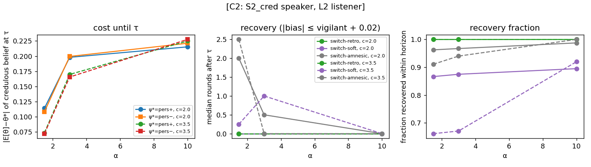

*Cost until τ and recovery vs α.*

### False-alarm cost (ψ* = inf, conditional on having switched)

| c | alpha | switch_type | false-alarm rate | n_switched | median_tau | |bias| cred @150 | |bias| vig @150 | |bias| switch @150 | std cred @150 | std switch @150 | mean |bias| cred, t≥τ | mean |bias| switch, t≥τ |
|---|---|---|---|---|---|---|---|---|---|---|---|---|
| 2 | 1.5 | amnesic | 0.123 | 37 | 12 | 0.001 | 0.001 | 0.003 | 0.003 | 0.006 | 0.012 | 0.021 |
| 2 | 1.5 | retro | 0.123 | 37 | 12 | 0.001 | 0.001 | 0.001 | 0.003 | 0.004 | 0.012 | 0.015 |
| 2 | 1.5 | soft | 0.123 | 37 | 12 | 0.001 | 0.001 | 0.001 | 0.003 | 0.003 | 0.012 | 0.013 |
| 2 | 3 | amnesic | 0.183 | 55 | 1 | 0.000 | 0.000 | 0.001 | 0.001 | 0.004 | 0.011 | 0.018 |
| 2 | 3 | retro | 0.183 | 55 | 1 | 0.000 | 0.000 | 0.000 | 0.001 | 0.001 | 0.011 | 0.013 |
| 2 | 3 | soft | 0.183 | 55 | 1 | 0.000 | 0.000 | 0.000 | 0.001 | 0.001 | 0.011 | 0.013 |
| 2 | 10 | amnesic | 0.023 | 7 | 44 | 0.000 | 0.000 | 0.012 | 0.001 | 0.020 | 0.011 | 0.040 |
| 2 | 10 | retro | 0.023 | 7 | 44 | 0.000 | 0.000 | 0.000 | 0.001 | 0.001 | 0.011 | 0.011 |
| 2 | 10 | soft | 0.023 | 7 | 44 | 0.000 | 0.000 | 0.000 | 0.001 | 0.001 | 0.011 | 0.012 |
| 3.5 | 1.5 | amnesic | 0.000 | nan | nan | nan | nan | nan | nan | nan | nan | nan |
| 3.5 | 1.5 | retro | 0.000 | nan | nan | nan | nan | nan | nan | nan | nan | nan |
| 3.5 | 1.5 | soft | 0.000 | nan | nan | nan | nan | nan | nan | nan | nan | nan |
| 3.5 | 3 | amnesic | 0.003 | 1 | 3 | 0.000 | 0.000 | 0.000 | 0.000 | 0.000 | 0.024 | 0.027 |
| 3.5 | 3 | retro | 0.003 | 1 | 3 | 0.000 | 0.000 | 0.000 | 0.000 | 0.000 | 0.024 | 0.028 |
| 3.5 | 3 | soft | 0.003 | 1 | 3 | 0.000 | 0.000 | 0.000 | 0.000 | 0.000 | 0.024 | 0.025 |
| 3.5 | 10 | amnesic | 0.003 | 1 | 71 | 0.000 | 0.000 | 0.001 | 0.000 | 0.007 | 0.000 | 0.010 |
| 3.5 | 10 | retro | 0.003 | 1 | 71 | 0.000 | 0.000 | 0.000 | 0.000 | 0.000 | 0.000 | 0.000 |
| 3.5 | 10 | soft | 0.003 | 1 | 71 | 0.000 | 0.000 | 0.000 | 0.000 | 0.000 | 0.000 | 0.000 |
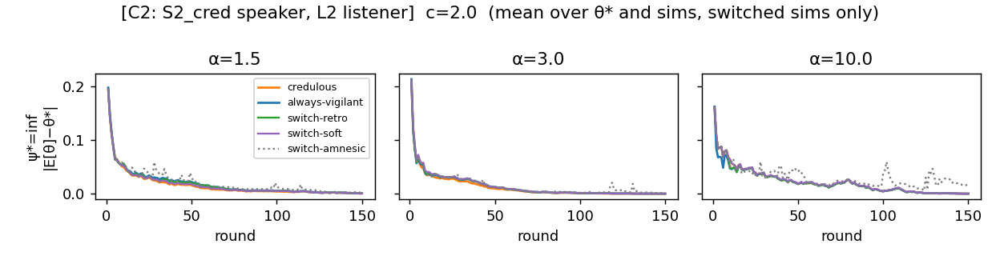

*ψ*=inf, sims that switched: |bias| by round, c=2.0.*

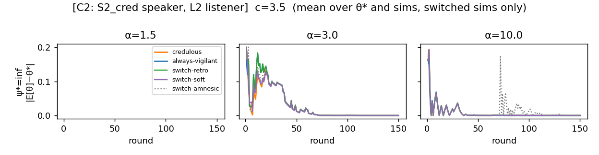

*ψ*=inf, sims that switched: |bias| by round, c=3.5.*

### Utterance frequency by round

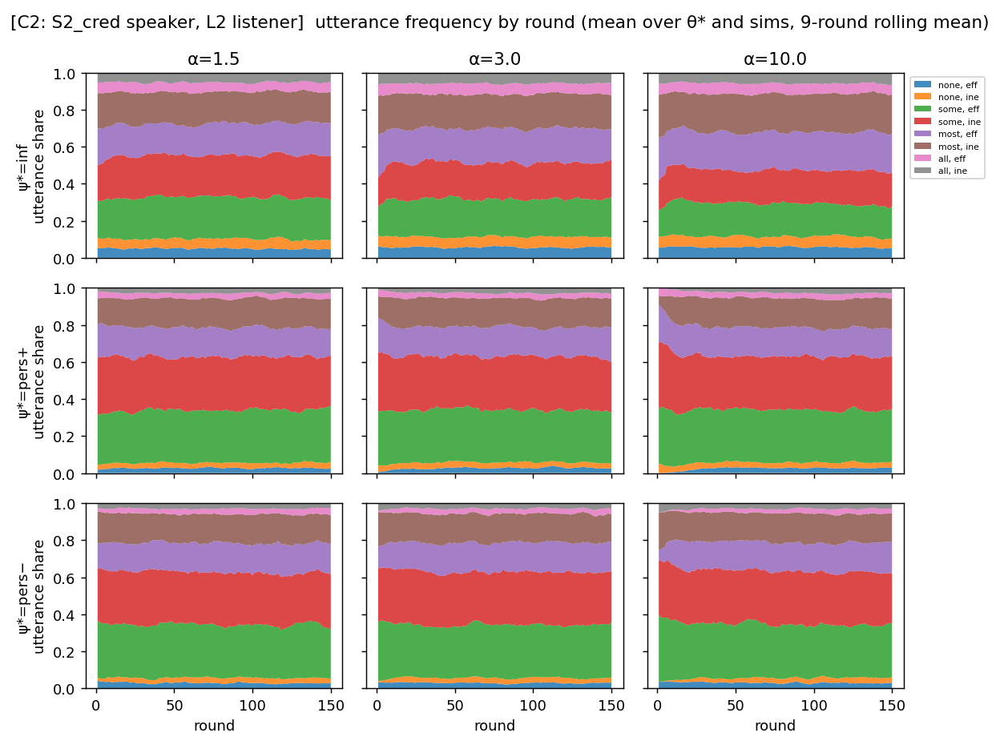

*Utterance share by round (rows ψ*, columns α), pooled over θ*.*

Share of rounds using a `some` utterance, by round block:

```
block            1-10  11-50  51-150
psi_star alpha                      
inf      1.5    0.415  0.452   0.453
         3.0    0.353  0.408   0.398
         10.0   0.336  0.367   0.356
pers+    1.5    0.580  0.571   0.573
         3.0    0.601  0.576   0.571
         10.0   0.647  0.578   0.572
pers−    1.5    0.588  0.580   0.566
         3.0    0.604  0.574   0.572
         10.0   0.640  0.592   0.572
```


## 6. Experiment C3 — hard_amnesic contrast in the feedback setting (α=3)

**Finding.** C3 adds the amnesic contrast to the feedback setting at α=3, the one α where
the three switch types are best separated. It confirms Experiment A's ordering under an
adaptive S2 and adds one detail: amnesic and soft are close to each other and clearly behind
retrospective at every horizon.

Mean |E[θ]−θ*| of the actual listener, pooled over ψ* and θ*, α=3:

| round | c=2.0 retro | c=2.0 soft | c=2.0 amnesic | c=3.5 retro | c=3.5 soft | c=3.5 amnesic |
|---|---|---|---|---|---|---|
| 25 | 0.052 | 0.065 | 0.067 | 0.058 | 0.071 | 0.078 |
| 50 | 0.033 | 0.040 | 0.038 | 0.030 | 0.047 | 0.046 |
| 100 | 0.016 | 0.020 | 0.020 | 0.015 | 0.024 | 0.020 |
| 150 | 0.008 | 0.012 | 0.012 | 0.009 | 0.015 | 0.013 |

Retrospective leads at every round and both cutoffs, by 30–50% at the tighter boundary.
Amnesic starts worst — it is the only variant that discards the history, so at round 25 it
is still paying for the uniform restart — and catches up with soft by round 100, ending
level with it. The gap between retrospective and the other two narrows over the horizon but
does not close by round 150, which is the same picture as Experiment A under an S1 speaker.

**The switch type does not change what the speaker does.** Crossing rates at α=3 are
indistinguishable between C3 and B: 0.910 against 0.908 for ψ*=pers+ at c=3.5, 0.400 against
0.403 for ψ*=inf, 0.917 against 0.893 for ψ*=pers−. Since the utterance stream in feedback
mode is generated against the actual switch type, this is a real (if unsurprising) negative
result: swapping the listener's post-alarm reconstruction does not change the speaker's
behaviour or its detectability. It is further evidence for the same conclusion as the
boundary-avoidance test in Experiment B — a one-round-myopic S2 does not organise its
utterances around the detector at all.

**A note on what this run cannot say.** C3's simulations are not paired with B's. In
feedback mode the stream depends on the switch type through the speaker's utility, so each
condition needs its own simulations and only the distributions can be compared; the small
θ*-level differences above are sampling noise at 60 simulations per cell, not per-run
contrasts.

Replica check (S2's internal listener vs. the actual listener): max |replica - actual| theta-marginal over all rounds and sims: 0.000e+00

### Belief trajectories

![E[θ] by round, rows (ψ*, switch type), columns θ*; α=3.0, c=2.0.](../switching_C3/analysis/C32_panels_c2.0_alpha3.0.png)

*E[θ] by round, rows (ψ*, switch type), columns θ*; α=3.0, c=2.0.*

![E[θ] by round, rows (ψ*, switch type), columns θ*; α=3.0, c=3.5.](../switching_C3/analysis/C32_panels_c3.5_alpha3.0.png)

*E[θ] by round, rows (ψ*, switch type), columns θ*; α=3.0, c=3.5.*

Other panels: [c=2.0, α=3.0](../switching_C3/analysis/C32_panels_c2.0_alpha3.0.png), [c=3.5, α=3.0](../switching_C3/analysis/C32_panels_c3.5_alpha3.0.png)

![|E[θ]−θ*| by round, mean over θ* and sims, c=2.0.](../switching_C3/analysis/C32_bias_c2.0.png)

*|E[θ]−θ*| by round, mean over θ* and sims, c=2.0.*

![|E[θ]−θ*| by round, mean over θ* and sims, c=3.5.](../switching_C3/analysis/C32_bias_c3.5.png)

*|E[θ]−θ*| by round, mean over θ* and sims, c=3.5.*

### Per-round speaker choice (trade-off)

`went persuasive` = the chosen utterance is the top choice of a Fang-S2 modelling a *credulous* L1 and not the top choice of S2-inf; `went informative` = the reverse; the two references coincide on a large share of rounds (grey in the CSV). Margin = (Sus(t−1) − boundary(t−1)) / boundary(t−1), pre-switch rounds only.

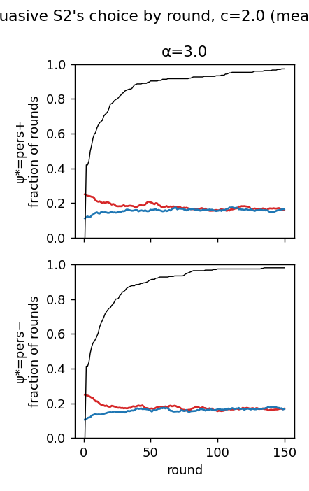

*Choice by round, c=2.0.*

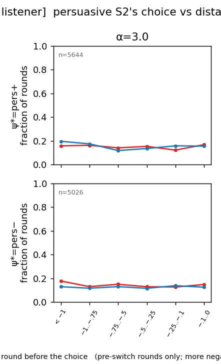

*Choice vs. distance to the boundary, c=2.0.*

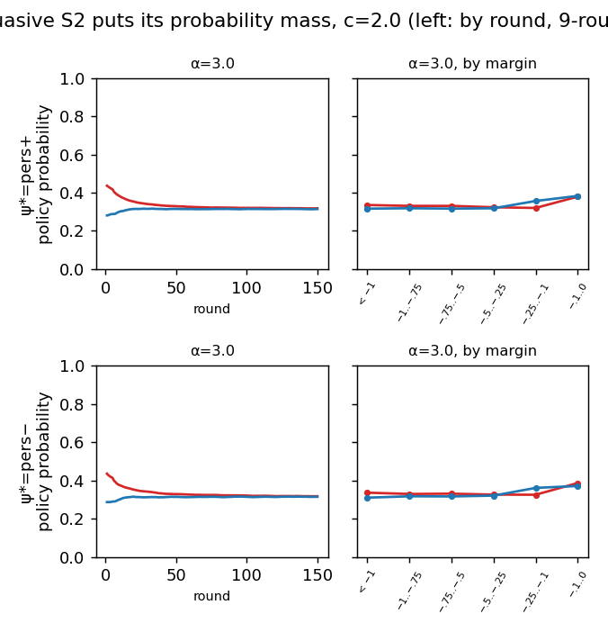

*Policy probability on each reference utterance, c=2.0. The continuous version of the same trade-off, and the readable one at low α where the speaker's softmax is too diffuse for an argmax to mean much.*

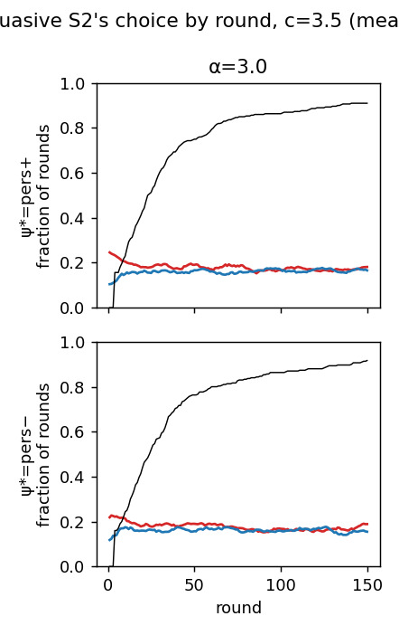

*Choice by round, c=3.5.*

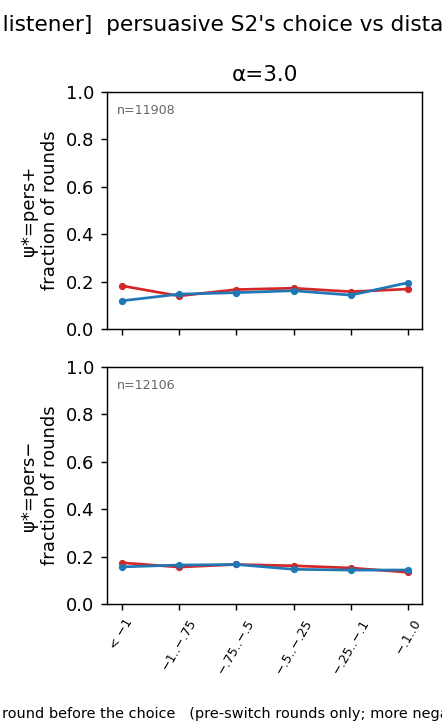

*Choice vs. distance to the boundary, c=3.5.*

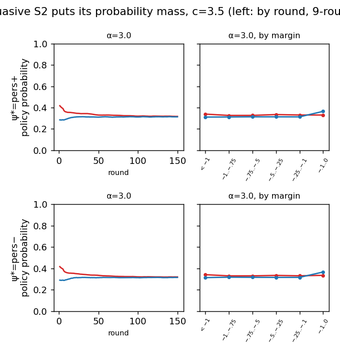

*Policy probability on each reference utterance, c=3.5. The continuous version of the same trade-off, and the readable one at low α where the speaker's softmax is too diffuse for an argmax to mean much.*

Fractions by round block (c=3.5):

| psi_star | alpha | switch_type | block | went persuasive | went informative | pers = inf | P(switched) |
|---|---|---|---|---|---|---|---|
| pers+ | 3 | amnesic | 1-5 | 0.246 | 0.105 | 0.170 | 0.063 |
| pers+ | 3 | amnesic | 6-10 | 0.205 | 0.146 | 0.142 | 0.196 |
| pers+ | 3 | amnesic | 11-25 | 0.187 | 0.158 | 0.156 | 0.395 |
| pers+ | 3 | amnesic | 26-50 | 0.186 | 0.158 | 0.156 | 0.674 |
| pers+ | 3 | amnesic | 51-150 | 0.173 | 0.164 | 0.150 | 0.861 |
| pers− | 3 | amnesic | 1-5 | 0.219 | 0.118 | 0.169 | 0.064 |
| pers− | 3 | amnesic | 6-10 | 0.219 | 0.176 | 0.137 | 0.205 |
| pers− | 3 | amnesic | 11-25 | 0.189 | 0.161 | 0.158 | 0.393 |
| pers− | 3 | amnesic | 26-50 | 0.185 | 0.162 | 0.153 | 0.672 |
| pers− | 3 | amnesic | 51-150 | 0.170 | 0.161 | 0.152 | 0.855 |
### Sus(t) against the boundary, retro vs soft

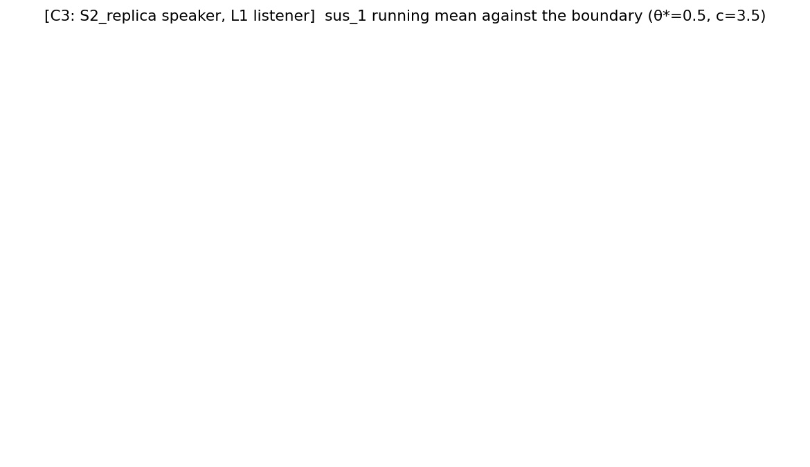

*Running mean Sus(t) (thin: 12 sims; thick: mean over sims not yet switched) and the boundary; θ*=0.5, c=3.5.*

### Achieved persuasion

|E[θ]−θ*| of the actual listener at round 25 (averaged over θ* and sims):

```
who                 always-vigilant (amnesic sims)  credulous (amnesic sims)  switch-amnesic
c   psi_star alpha                                                                          
2.0 pers+    3.0                             0.055                     0.077           0.071
    pers−    3.0                             0.051                     0.075           0.064
3.5 pers+    3.0                             0.052                     0.078           0.079
    pers−    3.0                             0.051                     0.080           0.077
```

|E[θ]−θ*| of the actual listener at round 50 (averaged over θ* and sims):

```
who                 always-vigilant (amnesic sims)  credulous (amnesic sims)  switch-amnesic
c   psi_star alpha                                                                          
2.0 pers+    3.0                             0.032                     0.062           0.042
    pers−    3.0                             0.030                     0.057           0.035
3.5 pers+    3.0                             0.032                     0.061           0.048
    pers−    3.0                             0.031                     0.063           0.043
```

|E[θ]−θ*| of the actual listener at round 100 (averaged over θ* and sims):

```
who                 always-vigilant (amnesic sims)  credulous (amnesic sims)  switch-amnesic
c   psi_star alpha                                                                          
2.0 pers+    3.0                             0.017                     0.051           0.019
    pers−    3.0                             0.017                     0.049           0.021
3.5 pers+    3.0                             0.016                     0.050           0.020
    pers−    3.0                             0.016                     0.052           0.019
```

|E[θ]−θ*| of the actual listener at round 150 (averaged over θ* and sims):

```
who                 always-vigilant (amnesic sims)  credulous (amnesic sims)  switch-amnesic
c   psi_star alpha                                                                          
2.0 pers+    3.0                             0.009                     0.046           0.011
    pers−    3.0                             0.010                     0.047           0.012
3.5 pers+    3.0                             0.009                     0.045           0.013
    pers−    3.0                             0.008                     0.046           0.014
```

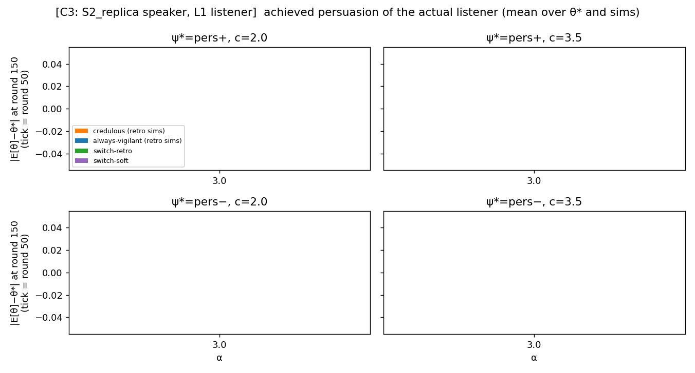

*Achieved persuasion at round 150 (bars) and 50 (ticks).*

### Level-mismatch alarm rate under S2-inf

The actual listener models S1-inf; the honest speaker is an S2-inf. These are not false-alarm rates of a correctly specified test: they are *level-mismatch* rates.

| c | switch_type | alpha | alarm rate | median τ | n |
|---|---|---|---|---|---|
| 2 | amnesic | 3 | 0.763 | 29 | 300 |
| 3.5 | amnesic | 3 | 0.400 | 79 | 300 |
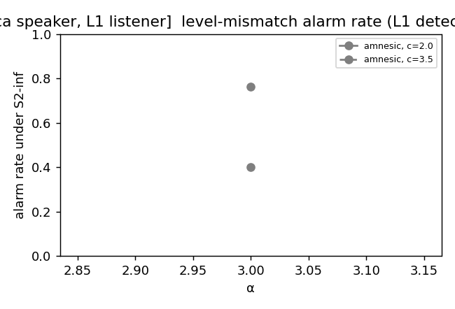

*Level-mismatch alarm rate vs α.*


## 7. Does the adaptive speaker avoid the detector?

Experiment B's Sus(t) figure appears to show the speaker riding just under the boundary, but it averages over the runs that have not yet switched, and that conditioning forces the survivor mean below the boundary whatever the speaker does. The selection-free test is the unconditional first-crossing rate at matched (θ*, ψ*, α, c) against Experiment C1, whose speaker models a fixed vigilant L1 and has no detector in its model. Run by `experiments/switching/compare_hugging.py`.

```
mean first-crossing rate difference (B - C1) over 120 matched persuasive cells: -0.0025 +/- 0.0068 (95% CI over cells)
no detectable difference in crossing rate: the boundary-hugging seen in B's Sus(t) figure is survivorship, not avoidance.
```

| alpha | crossing rate B | crossing rate C1 | B − C1 | median τ B | median τ C1 |
|---|---|---|---|---|---|
| 1.5 | 0.920 | 0.927 | -0.008 | 44.4 | 46.1 |
| 3 | 0.945 | 0.944 | 0.001 | 16.1 | 16.2 |
| 10 | 1.000 | 1.000 | -0.000 | 2.3 | 2.6 |

Pooled over persuasive cells only. `peek` shows the speaker the consequence of tripping the detector but it maximises a one-round utility, so it cannot trade a loss now for staying undetected later; evasion would need a speaker that plans over the horizon.


## 8. Flagged decisions, and what the grid was cut down to

**ASK-1 — informativeness of an honest S2 against the switching listener.** Implemented as
proposed: `Inf(u;O) = q_t(O|u)` taken from the *currently active* sub-listener before the
round's update, i.e. `DetectionListener.infer_obs` delegates to the naive listener before τ
and to the vigilant one after it, with no detour through `peek`. Routing informativeness
through `peek` as well would be more consistent, but it only ever matters for an honest S2
(the persuasive one has β=0 and never evaluates informativeness), and for an honest S2 the
two agree except on the single round where a candidate would trip the boundary. Not worth
the cost.

**ASK-2 — does the full sweep contain utterances?** It does: `results/full_sweep_v2` stores
`u_observed`, `O_true_idx` and `O_true_count` per round, so the trigger condition in the
spec ("if the parquet lacks utterances, regenerate") never fired. Experiment A regenerates
fresh S1 data regardless, for a reason the spec did not anticipate: the sweep was run with
the **11-point** θ space {0.0, 0.1, …, 1.0} as the agents' hypothesis grid, while these
experiments fix the **9-point** grid Θ = {0.1, …, 0.9}. The grid enters every likelihood the
speaker's internal L0 and the listener's L1 compute, so the stored streams were produced by
a different generative model and cannot be replayed under the 9-point grid. The sweep is
therefore used only as an external reference for first-crossing rates (section 1), where the
two grids agree to within sampling error.

**ASK-3 — caching the retrospective replay inside `peek`.** Not needed. A retro `peek` only
replays the history for candidates that would actually cross the boundary this round, and
before τ almost none do, so the replay branch is rarely taken. The Experiment B pilot timed
0.690 s per simulation without the cache and 0.681 s with it — within noise. The option is
implemented as `DetectionListener(retro_cache=True)` and tested to give bit-identical
results (`tests/test_switching.py::test_peek_retro_cache_gives_identical_results`), but it
is off in every run recorded here.

**Grid reductions against the 6-hour budget.** Pilots were timed before each study and the
numbers are in each study's `timing.md`. Experiment A came in at 0.50 s per simulation and
ran the full default grid (5 θ* × 3 ψ* × 4 α = 60 cells × 100 sims) in 14.7 wall-minutes,
far under its 1.5-hour target, so nothing was cut. Experiment B's single-cell pilot suggested
0.69 s per simulation, but the real grid ran at ≈1.38 s — the ψ*=inf cells rarely switch and
so pay for all 150 rounds of unswitched operation, which a pilot at ψ*=pers+ does not see —
putting the default grid at ~80 wall-minutes. Following the spec's shrink order, B was cut to
**60 simulations per cell** and **α ∈ {1.5, 3, 10}**, dropping α=5 on the evidence of A, where
α=5 and α=10 are nearly indistinguishable on every axis (switch rate 0.99 vs 1.00, credulous
|bias| at τ 0.17 vs 0.18, post-τ |bias| 0.033 vs 0.033). θ* keeps all five values and both c
and both switch types are kept, since those carry the headline contrasts. C1, C2 and C3 use
the same reduced axes. Nothing ran below the 40-simulation floor.

**Actual cost.** The five studies together took **78.5 wall-minutes** on 7 workers: A 14.7 (60 cells x 100 sims), B 41.2 (180 x 60), C1 8.4 (45 x 60), C2 7.9 (45 x 60), C3 6.2 (30 x 60), against the 6-hour budget. Every study overran its pilot projection by roughly 2x for the same reason, recorded in each `timing.md`: the pilot cell is psi*=pers+, which trips the detector early and then costs almost nothing, while the psi*=inf cells never switch and pay for all 150 rounds. A pilot at psi*=inf, or simply doubling the projection, would have sized these correctly first time.

**What is not comparable across studies.** A has 100 simulations per cell and four α values;
B, C1, C2 and C3 have 60 and three. B's α set is a subset of A's, so like-for-like cells can
be read across studies, but the α=5 column exists only in A. The C3 amnesic contrast cannot
be paired with B's retro and soft runs sim-by-sim: in feedback mode the utterance stream
depends on the switch type through the speaker's utility, so each condition is necessarily
its own set of simulations, and only the distributions are comparable.
